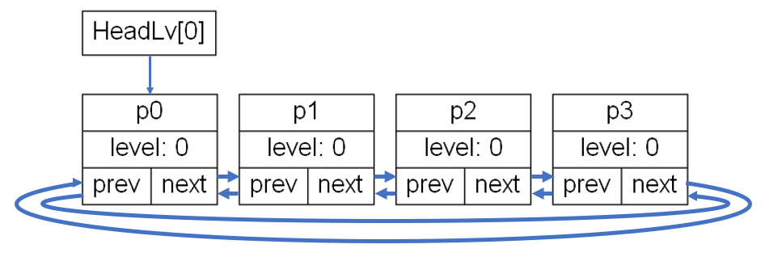
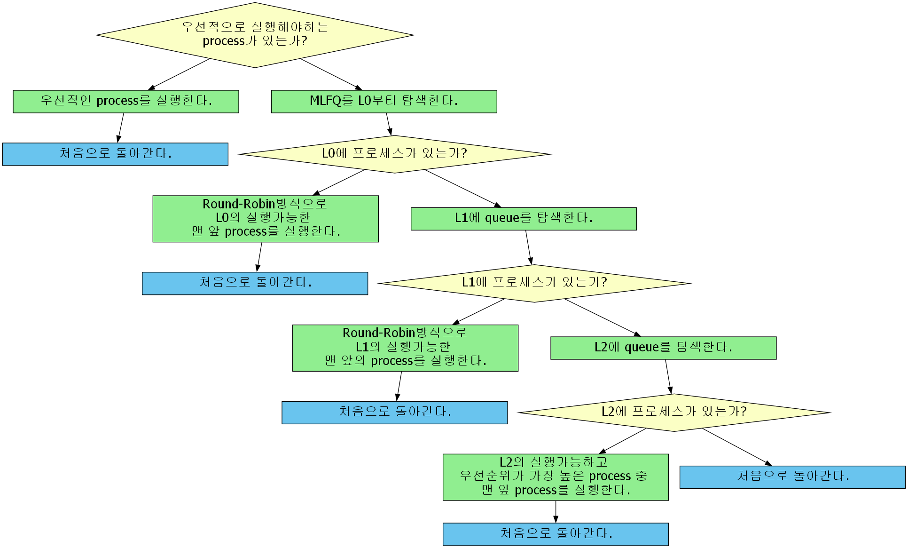
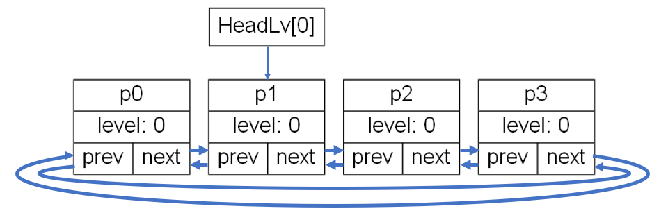

# [Project 1 WIKI]

[Notion](https://lacoruna.notion.site/Project-1-WIKI-2019019043-a0340abbbd63418e96d0eea934d94c46)으로도 볼 수 있습니다 :)  

# [Design]

project1 명세의 요구사항은 다음과 같다.

1. xv6의 스케줄러를 **MLFQ scheduler**로 교체하기.
2. scheduler의 **Lock/Unlock** 기능 구현하기
3. **user systemcall** 구현하기.

다음에서는 위의 요구사항의 구현 방식에 대해 설명한다.

## 1. Multi Level Feedback Queue Scheduler

### • 3-level feedback queue (with **circular doubly linked list)**

명세의 요구대로 **3-level feedback queue (L0, L1, L2)**를 구현하기 위해 **circular doubly linked list**의 자료구조를 사용하였다.

**doubly linked**의 특성은 process의 level이 바뀌어 queue간의 이동이 필요할 때, queue에서 분리와 연결이 간편하게 하기 위해 선택했다.

**circular** 특성은 **Round-Robin**의 방식으로 작동하는 **L0, L1**의 경우, queue의 맨 앞에 있는 process를 실행하고 queue의 맨 끝으로 이동시켜야 하는데, **circular queue**의 경우 헤드의 위치를 다음 process로 옮겨주면 이 기능을 간편하게 구현할 수 있다.

queue를 관리하기 위한 함수로는, queue의 head혹은 tail로 삽입하는 **insertHead**와 **insertTail** 함수와, queue의 head가 가리키는 process를 다음 process로 옮기는 **shiftHead** 함수, queue에서 해당 process를 분리하는 **detachNode** 함수를 구현했다.



circular doubly linked list로 구현된 L0 queue

### • MLFQ scheduler

다음은 설계한 MLFQ scheduler의 동작 방식이다. MLFQ scheduler로 작동하기 전, 우선적으로 실행해야 하는 process가 있다면 해당 process를 우선적으로 실행한다.



MLFQ scheduler의 flowchart

### • Round-Robin scheduling

**Round-Robin scheduling**은 queue에 있는 process들이 정해진 시간(time quantum)만큼만 실행되고 다음 process에게 프로세서를 양보하는 방식의 scheduling이다. 실행 가능한 정해진 시간(time qunatum)은 변경 없이 기존의 xv6를 따라간다.

**Round-Robin방식**으로 동작하기 위해서는 **해당 queue에서 process가 실행된 후에 queue의 tail로 보내줘야 다음 차례의 process들이 순차적으로 실행**될 수 있다**.** **circular queue에서는** 이 동작이, **head가 가리키는 노드(process)가 다음 노드를 가리키도록 만드는 것과 같은 결과**를 만든다.

이번에 구현된 디자인에서는 **해당 queue에서 탐색한 process가 non-runnable process여서 실행을 못하여도, queue의 tail로 이동시켜준다.**

queue L0과 L1은 Round-Robin scheduling을 하도록 설계되었다.


process p0을 실행할 차례인 L0 queue



process p0을 실행한 후 head가 이동한 L0 queue

### • priority scheduling

**priority scheduling**은 **우선순위가 가장 높은 process가 자신이 종료될 때까지 실행**되도록 한다. 우선순위가 같은 process가 있다면, queue에 가장 먼저 들어온 process가 먼저 실행된다. (**FCFS**)

이러한 scheduling 방식은 **starvation을 발생**할 수 있기 때문에, **priority boosting을 구현**해야 한다.

queue L2는 priority scheduling을 하도록 설계되었다.

### • process의 level 변화와  queue 이동

각 process는 자신의 level n에 해당하는 2*n+4 ticks의 time quantum을 갖는다. 모든 process는 생성되는 시점에서 L0 queue에 삽입되고 4 ticks의 time quantum을 갖게 된다.

process 는 자신에게 남은 time quantum 정보**( 이하 ticks )**를 저장하여, 실행될 때마다 1씩 감소시키고, 0이 되는 시점에서 level이 증가하게 된다. level이 증가하게 되면, 현재의 queue에서 나와 증가한 level에 해당하는 queue의 tail로 삽입이 된다. 남은 time quantum또한 증가한 레벨 n에 해당하는 2*n+4 ticks로 초기화 된다.

### • priority boosting 와 global tick

process가 실행되고 context switching이 일어나 다시 scheduler가 실행되면, scheduler는 해당 process의 tick( 남은 time quantum )을 감소시키고, **global tick**을 1 tick 증가시킨다. 그리고 global tick이 100 ticks이 되는 순간 **priority boosting**이 일어난다.

priority boosting이 일어나면 **L0의 tail**에 **L1의 process**들을 삽입한 후, L1의 process가 삽입된 **L0의 tail**에 다시 **L2의 process**들을 삽입한다. 이러한 구현 방식은 priority boosting이 일어나기전의 process들의 우선순위를 최대한 보장하기 위해서이다.

## 2. Scheduler Lock/Unlock

우선적으로 실행시켜야하는 process를 설정하고 해제하는 기능이며 system call로 호출이 가능하다. 두 system call을 호출할 때 비밀번호(2019019043)를 인자로 받아서 wrapper 함수 단에서 비밀번호의 일치여부를 확인하고, 일치 시 해당 기능을 수행, 불일치 시 호출한 process를 강제 종료한다. 만약 강제 종료된 경우, 해당 process의 pid, 남은 time quantum, 현재 위치한 queue의 level을 출력한다.

인터럽트로 실행 시 ( `__asm**__**("int $129");` , `__asm**__**("int $130");` ) 자격을 충족했다고 생각하고 비밀번호를 따로 받지 않는다.

### • schedulerLock

해당 system call을 호출한 process를 우선적으로 실행해야 하는 process로 설정한다. 설정하기 전, 이미 그러한 process가 있다면 ( = 자신이 schedulerLock을 호출하고 재호출한 경우) 그냥 현 상태를 유지한다.

scheduler lock이 실행되면, global ticks를 0으로 초기화한다.

### • schedulerUnlock

해당 system call을 호출한 process를 우선적으로 실행해야 하는 process에서 해제한다. 해제하기 전, 해당 process가 우선적으로 실행해야 하는 process로 설정되어있지 않다면 그냥 현 상태를 유지한다.

scheduler Unlock이 실행되면, 해당 process를 우선적으로 실행해야 하는 process에서 해제하면서, **L0의 head**( 맨 앞 요소 )로 삽입한다. 또한 ticks도 4로 초기화되고, priority도 3으로 재조정된다.

### • global ticks로 인한 MLFQ scheduling으로의 복귀

scheduler lock 기능이 실행되면 global ticks를 0으로 초기화하고, 하나의 process를 우선적으로 실행한다. global ticks이 100이 되고 나서도 우선적으로 실행되는 process가 종료되지 않았다면, 해당 process를 L0의 head로 삽입하고, priority boosting을 한다.

## 3. User System Calls

구현해야 하는 system call들이 user mode에서도 실행될 수 있도록 설계하였다. system call을 실행하면. 해당 wrapper function이 실행되고, wrapper function은 해당 기능을 하는 함수들을 호출하여 정해진 기능을 수행한다.

# [Implement]

다음에서는 Design 파트에 기재된 내용을 바탕으로 구현된 실제 코드를 분석한다.

## 1. MLFQ

MLFQ를 구현하기 위해서 구조체 `proc`에 포인터`prev`와 `next`를 추가하여 **circular doubly linked list**를 구현하였다. 또한 **queue 동작을 위한 함수**들을 구현하였고, process를 할당하고 종료하는 함수 `fork()`와 `exit()`에 **process를 queue에 삽입하는 기능**과 **분리하는 기능**을 추가하였다.

### • struct proc

구조체`proc`에 **자신이 속한 queue의 level을 나타내는 변수** `level`과 **남은 time quantum을 뜻하는 변수** `ticks`, **L2에서 실행 기준이 될 변수** `priority` ****를 추가해주었고, **circular doubly linked list로 동작하기 위해 필요한 포인터 변수** `prev`와 `next`도 추가해주었다.

```c
// proc.h
struct proc {
	/* 생략 */
  int level;
  int ticks;
  int priority;
  struct proc* prev;
  struct proc* next;
};
```

### • struct ptable

**priority boosting을 위한 변수** `globalTicks`, schedulerLock 호출 시 **우선으로 실행될 프로세스를 가리키는 변수** `preferentialProc`, **각 level의 queue의 head를 가리키는 변수** `headLv`를 추가해주었다.

`headLv[0]`은 **L0의 head**를, `headLv[1]`은 **L1의 head**를, `headLv[2]`은 **L2의 head**를 가리킨다.

```c
// proc.c
struct {
  struct spinlock lock;
  struct proc proc[NPROC];
  int globalTicks;
  struct proc *preferentialProc; // for schedulerLock/Unlock
  struct proc *headLv[3];
} ptable;
```

### • insertHead()

`insertHead()`는 인자로 받은 process를 자신의 level에 해당하는 queue의 **head로 삽입**하는 함수이다.  **삽입되는 process의 주소**를 인자(`newHead`)로 받는다.

이 함수의 결과는, 삽입할 process를 `insertTail()`로 tail에 삽입하고 해당 queue의 head를 새로 삽입한 process로 바꿔준 것과 결과가 같다. ( **circular queue**이기 때문 )

```c
// proc.c
// ! ptable.lock을 얻은 후에만 호출되어야 함 !
void
insertHead(struct proc *newHead)
{
  int lvOfQueue = newHead->level;
  insertTail(newHead);
  ptable.headLv[lvOfQueue] = newHead;
  return;
}
```

### • insertTail()

`insertTail()`는 인자로 받은 process를 자신의 level에 해당하는 queue의 **tail로 삽입**하는 함수이다. **삽입되는 process의 주소**를 인자(`newTail`)로 받는다. 동작 방식은 다음과 같다.

1. 들어가려는 queue가 비어있다면 ( 즉, head가 가리키고 있는 process가 없다면 ), 새로 삽입되는 process가 head가 된다.
2. 들어가려는 queue가 non-empty라면, 새로 삽입되는 process를 tail로 넣어준다.

삽입되는 queue는 process의 level값에 의해 결정된다는 것을 주의해야한다.

```c
// proc.c
// ! ptable.lock을 얻은 후에만 호출되어야 함 !
void
insertTail(struct proc *newTail)
{
  int lvOfQueue = newTail->level;
  // # 1. head가 기존에 없는 경우, newTail이 head가 된다.
  if(ptable.headLv[lvOfQueue] == 0){
    newTail->prev = newTail;
    newTail->next = newTail;
    ptable.headLv[lvOfQueue] = newTail;
    return;
  }

  // # 2. head가 있는 경우, new process(newTail)가 새로운 tail가 된다.
  struct proc* head = ptable.headLv[lvOfQueue];
  struct proc* oldTail = head->prev;
  oldTail->next = newTail;
  newTail->prev = oldTail;
  newTail->next = head;
  head->prev = newTail;
  return;
}
```

### • detachNode()

`detachNode()`는 인자로 받은 process를 속해 있던 **queue에서 분리**하는 함수이다. 인자(`p`)로 분리시킬 process를 받는다.

1. `p` 가 queue에 혼자일 경우( p가 head일 경우 ), head를 가리키는 변수를 0으로 설정해준다.
2. 혼자가 아닐 경우, `p`의 앞 뒤 프로세스들을 이어준다.
3. `p`의 `prev`와 `next`를 0으로 설정해준다.

```c
// proc.c
// ! ptable.lock을 얻은 후에만 호출되어야 함 !
void
detachNode(struct proc* p)
{
  // # 1. p가 큐에 혼자일 경우
  if(p->next == p){
    ptable.headLv[p->level] = 0;
  } 
  // # 2. 혼자가 아닐 경우
  else {
    //checkQueue(p->level); // ! for debug
    p->prev->next = p->next;
    p->next->prev = p->prev;
    // # 2-1. head일 경우
    if(p == ptable.headLv[p->level])
      ptable.headLv[p->level] = p->next;
  }
  p->prev = 0;
  p->next = 0;
  return;
}
```

### • shiftHead()

`shiftHead()`는 queue의 **head를** 현재 head의 **next process를 가리키도록** 하는 함수이다. head를 이동시킬 queue의 level을 인자(`level`)로 받는다.

만약 head가 없다면 ( 0이라면 ) 아무 행동을 하지 않는다.

```c
// proc.c
// ! ptable.lock을 얻은 후에만 호출되어야 함 !
int
shiftHead(int level)
{
  if(ptable.headLv[level]==0){
    return 0;
  }
  ptable.headLv[level] = ptable.headLv[level]->next;
  return 1;
}
```

### • mergeQueueToLv0()

`mergeQueueToLv0()`는 priority boosting이 일어날 때, L1와 L2를 L0에 병합하기 위한 함수이다. L0의 tail쪽에 L1을 먼저 병합한 후 L2를 나중에 병합하여, **최대한 기존의 스케줄링 우선순위**를 보장한다.

```c
// proc.c
// priority boosting을 위해 priorityBoosting()에서 호출 함.
// ! ptable.lock을 얻은 후에만 호출되어야 함 !
void
mergeQueueToLv0(){
  struct proc *p;

  // # priority boosting을 위해 L0의 ticks와 priority를 초기화.
  if(ptable.headLv[0] != 0){
    for(p=ptable.headLv[0];;p=p->next){
      p->priority = 3;
      p->ticks = 4;
      if(p->next == ptable.headLv[0])
        break;
    }
  }

  // # L1과 L2를 순서대로 L0의 tail에 삽입하여 병합 (최대한 기존의 순서를 보장하기 위해.)
  for(int i = 1; i < 3; i++){
    // # 삽입하려는 큐가 비어있을 때, 다음 큐 삽입
    if(ptable.headLv[i] == 0)
      continue;

    // # 삽입하려는 큐의 proc들의 lv과 tick을 초기화해줌.
    for(p=ptable.headLv[i];;p=p->next){
      p->level = 0;
      p->priority = 3;
      p->ticks = 4;
      if(p->next == ptable.headLv[i])
        break;
    }

    // # when Lv0 quqeue is empty
    if(ptable.headLv[0] == 0){
      ptable.headLv[0] = ptable.headLv[i];
    }
    // # when Lv0 queue is non-empty
    else{
      (ptable.headLv[0]->prev)->next = (ptable.headLv[i]);
      (ptable.headLv[i]->prev)->next = (ptable.headLv[0]);
      struct proc *tmp = (ptable.headLv[0]->prev);
      (ptable.headLv[0])->prev = (ptable.headLv[i]->prev);
      (ptable.headLv[i])->prev = tmp;
    }
    ptable.headLv[i]=0;
  }  
}
```

### • allocproc()

기존에 있던 함수`allocproc()`에, process를 생성 시 **구조체 `proc`의 멤버 변수** `level`과 `priority`, `ticks`를 **초기화하는 부분을 추가**하였다. process가 처음 생성될 때는 level은 0으로, priority는 3으로, ticks(time quantum)은 4로 초기화된다. 그 후 `insertTail()`을 통해 **L0의 tail에 삽입**된다.

```c
// proc.c
static struct proc*
allocproc(void)
{
	/* 생략 */

found:
  p->state = EMBRYO;
  p->pid = nextpid++;
  p->level = 0; // process가 처음 생성될 때는 lv0으로 시작.
  p->priority = 3;
  p->ticks=4;
  insertTail(p); // process를 L0의 tail로 삽입.

	/* 생략 */
}
```

### • exit()

기존에 있던 함수`exit()`에, process의 `state`를 `ZOMBIE`로 변경 시 기존에 있던 **queue에서 분리시키는 부분을 추가**하였다. 함수`detachNode()`를 이용하였다.

```c
// proc.c
void
exit(void)
{
	/* 생략 */

  // Jump into the scheduler, never to return.
  curproc->state = ZOMBIE;
  detachNode(curproc); // 새로 추가한 부분
  sched();
  panic("zombie exit");
}
```

## 2. Scheduler

기존 xv6의 함수 `scheduler()`를 수정하여 새롭게 디자인한 방식으로 동작하게 바꾸었다. 동작 방식은 앞서 **[Design]**파트의 **MLFQ scheduler**에 서술한 설명과 같다. ([ • MLFQ scheduler](https://www.notion.so/MLFQ-scheduler-09185bad2477403aa27a26faabed917e?pvs=21) ) 

우선적으로 실행해야 하는 process가 있다면 해당 process를 우선해서 실행한다. 그러한 process가 없다면 MLFQ scheduler 방식으로 동작한다.

### • scheduler()

기존의 `scheduler()`함수는 `ptable.proc`를 순회하며 `RUNNABLE`상태의 process를 찾아서 실행시키는 구조였다. 이번 프로젝트로 변경된 구조에서는 다음과 같이 동작한다.

1. `ptable`의 `preferentialProc`을 확인하여, 우선적으로 실행해야하는 프로세스가 있는지 확인한다. 
    1. 있다면 `execProc()`를 호출하여 해당 프로세스를 실행한다.
    process 실행에 성공하였다면, `ptable`의 `lock`을 반환하고 for문을 반복한다.
    2. 없다면 MLFQ scheduler로 작동한다.
2. `findAndExec_RR(0)`를 호출하여 L0 queue를 Round-Robin scheduling 방식으로 실행한다.
    1. process 실행에 성공하였다면, `ptable`의 `lock`을 반환하고 for문을 반복한다.
3. `findAndExec_RR(1)`를 호출하여 L1 queue를 Round-Robin scheduling 방식으로 실행한다.
    1. process 실행에 성공하였다면, `ptable`의 `lock`을 반환하고 for문을 반복한다.
4. `findAndExec_PRIO(2)`를 호출하여 L2 queue를 priority scheduling 방식으로 실행한다.
    1. process 실행에 성공하였다면, `ptable`의 `lock`을 반환하고 for문을 반복한다.
5. 실행할 process가 없다면 `ptable`의 `lock`을 반환하고 for문을 반복한다.

```c
// proc.c
void
scheduler(void)
{
  //struct proc *p;
  struct cpu *c = mycpu();
  c->proc = 0;

  for(;;){
    // Enable interrupts on this processor.
    sti();

    // Loop over process table looking for process to run.
    acquire(&ptable.lock);

    // # EXECUTE ONE PROCESS
    // # If there is a preferential process ( when the schedulerLock is called )
    if(ptable.preferentialProc){
      if(ptable.preferentialProc->state == RUNNABLE)
        execProc(ptable.preferentialProc);
      else
        ptable.preferentialProc = 0;

      release(&ptable.lock);
      continue;
    }

    // # MLFQ SCHEDULING

    // # Lv0 scheduling
    if(findAndExec_RR(0)){
      release(&ptable.lock);
      continue;
    }

    // # Lv1 scheduling
    if(findAndExec_RR(1)){
      release(&ptable.lock);
      continue;
    }

    // # Lv2 scheduling
    if(findAndExec_PRIO(2)){
      release(&ptable.lock);
      continue;
    }
    release(&ptable.lock);
  }
}
```

### • execProc()

`execProc()`는 **process를 실질적으로 실행**시키는 함수이다. 실행되고 있는 스케줄러와 인자로 받은 process(`p`)를 context swiching한다. 기존에 있는 `scheduler()`의 context switching 부분을 그대로 가져오고, process의 ticks와 global ticks를 변화시키기 위해 `spendTicks()`와 `updateGlobalTicks()`를 호출하는 부분을 추가했다.

```c
// proc.c
// execute Process.
// ! ptable.lock을 얻은 후에만 호출되어야 함 !
void
execProc(struct proc *p)
{
  struct cpu *c = mycpu();
  // Switch to chosen process.  It is the process's job
  // to release ptable.lock and then reacquire it
  // before jumping back to us.
  c->proc = p;
  switchuvm(p);
  p->state = RUNNING;

  swtch(&(c->scheduler), p->context);
  switchkvm();

  // # ticks 줄이기 & globalticks 증가
  spendTicks(p);
  updateGlobalTicks();

  // Process is done running for now.
  // It should have changed its p->state before coming back.
  c->proc = 0;
}
```

### • spendTicks()

`spendTicks()`는 실행된 **process의 ticks( 남은 time quantum )를 1 tick 줄이고**, **ticks가 0이 되면** **level을 증가**시켜주거나 **priority를 올려주는** 함수이다.

인자(`p`)로 받은 process의 멤버 변수 `ticks`를 1 줄인다. 줄인 `ticks`가 0이라면,

1. **`level`이 2보다 작은 경우**라면 process를 `detachNode()`를 호출해 **queue에서 분리**시켜주고, **`level`을 증가**시킨 후, 다시 높아진 `level`에 해당하는 **queue에 꼬리로 삽입**한다.
그 후 **time quantum**을 새로운 level에 맞게 2*level+4로 **다시 초기화** 해준다.
2. **`level`이 2**라면 level을 올리는 대신, 멤버변수 **priority를 1 낮춘다**. ( 최대 0까지 줄일 수 있다. )
그 후 **time quantum**을 8( 2*2+4 ) 로 **다시 초기화** 해준다.

만약 인자로 받은 process의 상태가 `ZOMBIE`라면 `level`과 `priority`를 변경하지 않는다. 이미 종료된 프로세스는 `level`과 `priority`를 변경할 필요가 없는 뿐더러, `ZOMBIE`가 되는 과정에서 **`detachNode()`를 호출하여 queue에서 나온 상태**인데, `level`을 변화시키는 과정에서 **queue에 삽입되는 부분이 있기 때문에**, **해서는 안된다.**

```c
// proc.c
// when process ran, the processs's ticks decrease by 1
// ! ptable.lock을 얻은 후에만 호출되어야 함 !
void
spendTicks(struct proc *p)
{
  p->ticks--;
  if(p->ticks == 0){

    //# process가 종료된 상황이면, level과 priority를 변경 안함.
    if(p->state==ZOMBIE){
      return;
    }

    if(p->level < 2){
      detachNode(p);
      (p->level)++;
      insertTail(p);
      p->ticks = 2*(p->level)+4;
      return;
    }
    // If it is at lv2
    if(p->priority > 0)
      p->priority--;
    p->ticks=8;
  }
  return;
}
```

### • updateGlobalTicks()

`updateGlobalTicks()`는 process를 실행시킨 후 호출되어 **global ticks를 1 증가**시키고 **100이 될 때 priority boosting을 일으키고**, **scheduler가 lock된 상태라면 해제**해주는 함수이다.

`ptable.globalticks`가 99인 상태에서 호출되면 ( global ticks가 100이 될 차례가 되면 ), `ptable.preferentialProc`를 확인하여 우선적으로 실행되어야 하는 process가 설정되어 있는지 확인한다. 만약 설정되어 있다면, 다시 MLFQ scheduler로 돌아가기 위한 작업을 수행한다.

1. 우선적으로 실행해야하는 process가 종료되지 않았다면 ( 상태가 ZOMBIE가 아니라면 ), 그 process를 queue에서 분리한 후, L0에 들어갈 조건을 만족시켜주고 ( 멤버 변수 level, priority, ticks를 초기화 ), `insertHead()`를 호출해 L0의 head로 삽입한다. 만약 상태가 ZOMBIE라면 이 과정이 의미가 없기 때문에 생략한다.
2. 그 후,  `ptable.preferentialProc`를 0으로 만들어줘서 우선적으로 실행시켜야하는 process가 없다고 알린다.

이후 `priorityBoosting()`를 호출하여 priority boosting을 수행한다.

global ticks가 100이 될 차례가 아니라면, global ticks를 1 증가시킨다.

```c
// proc.c
// when process ran, global ticks increase by 1
// ! ptable.lock을 얻은 후에만 호출되어야 함 !
void
updateGlobalTicks(void)
{
  // # when the globalTicks become 100
  if(ptable.globalTicks == 99){
    // # If scheduler"Lock" is on,
    if(ptable.preferentialProc){

      if(ptable.preferentialProc->state!=ZOMBIE){
        detachNode(ptable.preferentialProc);
        ptable.preferentialProc->level = 0;
        ptable.preferentialProc->priority = 3;
        ptable.preferentialProc->ticks = 4;
        insertHead(ptable.preferentialProc);
      }
      ptable.preferentialProc = 0;
    }
    return priorityBoosting();
  }

  ptable.globalTicks++;
  return;
}
```

### • priorityBoosting()

`priorityBoosting()`는 global ticks가 100이 될 때 호출되어 priority boosting을 수행한다.

`mergeQueueToLv0()`을 호출하여 모든 queue의 process들을 level을 0으로, ticks를 4로, priority를 3으로 초기화해주고, L0로 병합한다. 이후 global ticks를 0으로 초기화해준다.

```c
// proc.c
// when global ticks become 100, priority boosting occurs.
// ! ptable.lock을 얻은 후에만 호출되어야 함 !
void
priorityBoosting(void)
{
  mergeQueueToLv0();
  ptable.globalTicks = 0;
  return;
}
```

### • findAndExec_RR()

`findAndExec_RR()`는 인자로 받은 level에 해당하는 queue에서 **RR scheduling 방식으로** 실행 가능한 process가 있다면 실행시키고, 실행했는지의 여부를 반환하는 함수이다.

인자(`level`)로 queue의 level을 받고, 해당 queue에서 실행 가능한 process가 있는지 탐색하고 실행한다. 탐색 및 실행은 다음과 같이 진행된다.

1. 탐색 시작시 해당 queue의 head를 가리키는 포인터 변수 `ptable.headLv[level]`를 시작지점(`searchingStartPoint`)으로 설정한다.
2. head가 가리키는 process가 실행 가능한지 ( `RUNNABLE`인지 )  판별한다.
    1. process가 **실행 가능**하다면 ( `state`가 `RUNNABLE`이라면 ), `shiftHead()`를 호출하여 head를 다음 process로 옮기고 ( **= 현재 head process를 queue의 tail로 옮김 = 다음 스케줄링 시 다음 process부터 탐색 시작** ), `execProc()`를 호출하여 해당 process를 실행한다. 그 후 process가 실행됨을 알리기 위해 1을 반환하며 함수를 종료한다.
    2. process가 **실행이 불가능** 하다면, `shiftHead()`를 호출하여 head를 다음 process로 옮겨서, 반복문을 통해 다음 process가 실행 가능한지 판별한다. 만약 옮긴 head가 시작지점과 동일 하다면 ( queue를 한 바퀴 다 탐색한 경우 ), process를 실행하지 못했다고 ( 실행 가능한 process가 없었다고 ) 알리기 위해 0을 반환하며 함수를 종료한다.

```c
// proc.c
// find runnable procces in queue and exec.
// if found and executed process, return 1
// else if didn't find runnable process and didn't excute, retrun 0
// ! ptable.lock을 얻은 후에만 호출되어야 함 !
int
findAndExec_RR(int level){
  struct proc *p; // 실행시킬 프로세스 변수
  struct proc* searchingStartPoint = ptable.headLv[level];

  // # Queue가 비어 있지 않다면 탐색 시작.
  if(ptable.headLv[level]!=0){
    
    while(1){
      // # runnable proc 발견
      if(ptable.headLv[level]->state == RUNNABLE){
        p = ptable.headLv[level]; // 실행할 프로세스 저장.
        // # head(다음 스케줄링 시의searchingStartPoint)를 옮긴다. RR의 핵심.
        // # ( 원형 큐이기 때문에, 이 행위는 실행한 프로세스를 queue의 tail로 넘겨주는 것과 같은 행위. )
        shiftHead(level);
        // # execute process
        execProc(p);  // 실행된 head프로세스가 queue에서 혼자인 경우, exec하면서 레벨이 전환되면서, head가 사라질 수도 있음.
        return 1;
      }
      // # runnable proc가 아니라면 탐색을 계속하기 위해 head를 한칸 옮겨준다.
      // # RUNNABLE이 아니여서 실행되지 못한 process도 순서가 뒤로 밀린다.
      // # ( 원형 큐이기 때문에, 이 행위는 살펴본 프로세스를 queue의 tail로 넘겨주는 것과 같은 행위. )
      shiftHead(level);
      // # 시작했던 큐의 처음 위치까지 돌아오면 탐색 종료
      if(ptable.headLv[level] == searchingStartPoint)
        break;
    }
  }
  // # 실행한 process가 없다고 0을 반환하여 알려줌.
  return 0;
}
```

### • findAndExec_PRIO()

`findAndExec_PRIO()`는 인자로 받은 level에 해당하는 queue에서 **priority scheduling 방식으로** 실행 가능한 process가 있다면 실행시키고, 실행했는지의 여부를 반환하는 함수이다.

인자(`level`)로 queue의 level을 받고, 해당 queue에서 실행 가능한 process가 있는지 탐색하고 실행한다. 탐색 및 실행은 다음과 같이 진행된다.

1. 탐색 시작시 해당 queue의 head를 가리키는 포인터 변수 `ptable.headLv[level]`를 시작지점(`searchingStartPoint`)으로 설정한다.
2. head가 가리키는 process가 실행 가능한지 ( `RUNNABLE`인지 )  판별한다.
    1. process가 **실행 가능**하다면 ( `state`가 `RUNNABLE`이라면 ), process의 **priority에 따라** 수행을 결정한다.
        1. **priority가 0이라면**, 해당 process를 실행하는 과정을 수행한다. `ptable.headLv[level] = searchingStartPoint;`를 통해, 탐색을 위해 이동했던 head를 탐색 시작 위치로 다시 옮겨준다. 이는 다음 스케줄링 시의 탐색 시작 지점을 queue의 맨 앞으로 유지시켜주기 위함이다. 이로 **FCFS를 보장**한다.
        그 후 `execProc()`를 호출하여 해당 process를 실행한다. 그 후 process가 실행됨을 알리기 위해 1을 반환하며 함수를 종료한다.
        2. **priority가 0이 아니라면**, 해당 process의 주소를 변수( `firstPrio1Proc`, `firstPrio2Proc`, `firstPrio3Proc` )에 저장해두고 **탐색을 계속**한다. 만약 저장하려는 변수에 이미 값이 있으면 새로 저장하지 않는다.
        이는 queue를 다 탐색하고 나서 priority가 0인 process가 없는 경우, 다음으로 높은 priority를 가진 process가 있는지 **재탐색 하는 것을 막기 위해서**이다.
    2. process가 **실행이 불가능** 하다면, `shiftHead()`를 호출하여 head를 다음 process로 옮겨서, 반복문을 통해 다음 process가 실행 가능한지 판별한다. 만약 옮긴 head가 시작지점과 동일 하다면 ( queue를 한 바퀴 다 탐색한 경우 ), 반복문을 나와 탐색을 종료한다.
    3. 반복문이 종료된 경우, runnable이며 `priority`가 0인 process가 없어서 실행을 못한 것이다.
    이 경우, if문을 통해 그 다음 우선순위의 runnable process가 있는지 확인하고 살행시킨다. 실행시켰다면 process가 실행됐음을 알리기 위해 1을 반환하며 종료한다.
    4. 만약 runnable인 process가 하나도 없어서 process를 실행하지 못하였다면, 이를 알리기 위해 0을 반환하며 함수를 종료한다.

```c
// proc.c
int
findAndExec_PRIO(int level){
  struct proc *p; // 실행시킬 프로세스 변수
  struct proc *searchingStartPoint = ptable.headLv[level];
  struct proc *firstPrio1Proc = 0;
  struct proc *firstPrio2Proc = 0;
  struct proc *firstPrio3Proc = 0;

  // # Queue가 비어 있지 않다면 탐색 시작.
  if(ptable.headLv[level]!=0){

    while(1){
      // # runnable proc 발견
      if(ptable.headLv[level]->state == RUNNABLE){

        // # priority가 0이라면 주저말고 실행
        if(ptable.headLv[level]->priority == 0){
          p = ptable.headLv[level]; // 실행할 프로세스 저장.
          // # prio scheduling 에서는 rr 처럼 shiftHead(다음 스케줄링 시의searchingStartPoint를 옮김)을 해주지 않는다. FCFS를 보장하기 위해서.
          // # 대신 RR과 달리, 탐색을 위해 이동한 head를 큐의 처음 위치(탐색 시작 위치)로 옮겨놓음. (FCFS 보장)
          ptable.headLv[level] = searchingStartPoint;
          // # execute process
          execProc(p);  // 실행된 head프로세스가 queue에서 혼자인 경우, exec하면서 레벨이 전환되면서, head가 사라질 수도 있음.
          return 1;
        }

        // # priority가 0이 아니라면 위치만 기록
        else if(firstPrio1Proc == 0 && ptable.headLv[level]->priority==1)
          firstPrio1Proc = ptable.headLv[level];
        else if(firstPrio2Proc == 0 && ptable.headLv[level]->priority==2)
          firstPrio2Proc = ptable.headLv[level];
        else if(firstPrio3Proc == 0 && ptable.headLv[level]->priority==3)
          firstPrio3Proc = ptable.headLv[level];
      }

      // # runnable proc가 아니라면 헤드를 한칸 옮겨준다. 다음 process를 탐색하기 위해
      shiftHead(level);

      // # 시작했던 큐의 처음 위치까지 돌아오면 탐색 종료
      if(ptable.headLv[level] == searchingStartPoint)
        break;

    }

    // # priority가 0인 process를 못 찾았기 때문에 그 아래 우선순위가 있다면 실행 후 리턴.
    if(firstPrio1Proc != 0){
      execProc(firstPrio1Proc);
      return 1;
    }
    else if(firstPrio2Proc != 0){
      execProc(firstPrio2Proc);
      return 1;
    }
    else if(firstPrio3Proc != 0){
      execProc(firstPrio3Proc);
      return 1;
    }
  }
  // # 실행한 process가 없다면 0을 반환
  return 0;
}
```

### • schedulerLock()

`schedulerLock()`은 현재 process를 **우선적으로 실행시켜야 하는 process로 설정**하고 **global ticks를 0으로 초기화**하는 함수이다.

`ptable`의 멤버에 접근하기 위해 `lock`을 얻는다. 그 후 `ptable.preferentialProc`를 확인하여 우선적으로 실행시켜야 하는 process로 실행 가능한 process가 설정되어 있는지 확인한다.

만약 이미 실행가능한 process가 우선적으로 실행되고 있었다면 ( 현재 process가 이미 우선적으로 실행되고 있는데, 다시 schedulerLock을 호출한 경우 ), 별다른 수행 없이 `lock`을 반환하고, 0을 반환하며 종료한다.

설정된 우선적인 process가 없다면, global ticks를 0으로 초기화하고, 현재 process(`myproc()`)를 우선적으로 실행해야 하는 process로 등록한다. 그 후 schedulerLock을 성공했음을 알리는 1을 반환하며 종료한다.

```c
// proc.c
int
schedulerLock(void)
{
  acquire(&ptable.lock);

  // # if there is already a preferentialProc, schedulerLock will be failed
  if(ptable.preferentialProc && ptable.preferentialProc->state == RUNNABLE){
    release(&ptable.lock);
    return 0;
  }

  // # 1. reset global ticks
  ptable.globalTicks = 0;

  // # 2. myproc() become a preferentialProc
  ptable.preferentialProc = myproc();

  release(&ptable.lock);
  return 1;
}
```

### • schedulerUnlock()

`schedulerUnlock()`은 **우선적으로 실행시켜야 하는 process를 해제**하고 **scheduler를 MLFQ scheduling 방식으로 되돌린다**. 또한 해당 process의 **priority를 3으로 설정**하고, **ticks(time quantum)을 4로 초기화**한 후 **L0의 head로 삽입**한다.

`ptable`의 멤버에 접근하기 위해 `lock`을 얻는다. 그 후 `ptable.preferentialProc`를 확인하여 우선적으로 실행시켜야 하는 process로 현재 process(`curproc`)가 설정되어 있는지 확인한다.

만약 그렇지 않다면, 이미 우선적으로 실행하는 process가 없다는 것이므로 schedulerUnlock을 할 필요가 없다. 따라서 `lock`을 반환하고, 0을 반환하며 종료한다.

현재 process가 우선적으로 실행되고 있었다면, 종료되어 있는지 확인 한다.

종료되어 있지 않다면, `detachNode()`를 호출하여 queue에서 분리 한 후, `level`을 0으로 설정하며 `priority`와 `ticks` 값을 재설정한다. 그 후 `insertHead()`를 호출하여 L0의 head로 삽입한다.

그 후 `ptable`의 `lock`을 반환하고, schedulerUnlock을 성공했음을 알리는 1을 반환하며 종료한다.

```c
// proc.c
int
schedulerUnlock(void)
{
  struct proc *curproc = myproc();
  acquire(&ptable.lock);

  // # 예외처리. unlock하는 것이 의미가 없을 때.
  if (curproc != curproc ){
    release(&ptable.lock);
    return 0;
  }

  if(ptable.preferentialProc->state!=ZOMBIE){
    detachNode(ptable.preferentialProc);
    ptable.preferentialProc->level = 0;
    ptable.preferentialProc->priority = 3;
    ptable.preferentialProc->ticks = 4;
    insertHead(ptable.preferentialProc);
  }

  // # 먼저 스캐줄링 해야하는 프로세스를 없앤다.
  ptable.preferentialProc = 0;

  release(&ptable.lock);
  return 1;
}
```

## 3. User System Calls

user mode에서 사용할 수 있는 system call을 구현하였다. 목록은 다음과 같다.

- `void yield(void)`
- `int getLevel(void)`
- `void setPriority(int pid, int priority)`
- `void schedulerLock(int password)`
- `void schedulerUnlock(int password)`

이 system call 중 하나를 호출하면, `usys.S`와 `syscall.c`에 의해 해당하는 wrapper function이 실행된다. wrapper function은 `prac_syscall.c`에 정의되어 있다. wrapper function은 호출 시 `proc.c`에 있는 함수들을 호출하여 요구된 기능을 수행한다.

다음은 해당 내용의 `usys.S`와 `syscall.h`, `syscall.c`의 일부이다.

```nasm
#define SYSCALL(name) \
  .globl name; \
  name: \
    movl $SYS_ ## name, %eax; \
    int $T_SYSCALL; \
    ret

SYSCALL(yield)
SYSCALL(getLevel)
SYSCALL(setPriority)
SYSCALL(schedulerLock)
SYSCALL(schedulerUnlock)
```

```c
// syscall.h
// System call numbers
#define SYS_yield           23
#define SYS_getLevel        24
#define SYS_setPriority     25
#define SYS_schedulerLock   26
#define SYS_schedulerUnlock 27
```

```c
// syscall.c
extern int sys_yield(void);
extern int sys_getLevel(void);
extern int sys_setPriority(void);
extern int sys_schedulerLock(void);
extern int sys_schedulerUnlock(void);

static int (*syscalls[])(void) = {

/* 생략 */

[SYS_yield]           sys_yield,
[SYS_getLevel]        sys_getLevel,
[SYS_setPriority]     sys_setPriority,
[SYS_schedulerLock]   sys_schedulerLock,
[SYS_schedulerUnlock] sys_schedulerUnlock,
};
```

### • yield()

system call `yield()`는 현재 process를 수행하고 있는 프로세서를 다음 process에게 양보하게 하는 system call이다. 동작 방식은 다음과 같다.

1. system call `yield()`는 wrapper function `sys_yield()`를 호출한다.
2. `sys_yield()`는 기능 수행을 위해 `proc.c`에 있는 `yield()`함수를 호출한다.
3. `proc.c`의 `yield()` 함수는 기존 xv6에 구현되어 있는 함수로, 현재 실행되고 있는 process의 프로세서를 포기하고 `RUNNABLE` 상태로 돌아가도록 한다.

```c
// user.h
void yield(void);
```

```c
// prac_syscall.c
void
sys_yield(void)
{
	return yield();
}
```

```c
// proc.c
// Give up the CPU for one scheduling round.
void
yield(void)
{
  acquire(&ptable.lock);  //DOC: yieldlock
  myproc()->state = RUNNABLE;
  sched();
  release(&ptable.lock);
}
```

### • getLevel()

system call `getLevel()`은 현재 process가 속한 queue의 level을 반환한다. 동작 방식은 다음과 같다.

1. system call `getLevel()`는 wrapper function `sys_getLevel()`를 호출한다.
2. `sys_getLevel()`는 기능 수행을 위해 `proc.c`에 있는 `getLevel()`함수를 호출한다.
3. `proc.c`의 `getLevel()` 함수는 현재 process(`myproc()`)의 자신이 속한 queue의 level을 나타내는 멤버 변수인 `level`을 반환한다.

```c
// user.h
int getLevel(void);
```

```c
// prac_syscall.c
int
sys_getLevel(void)
{
	return getLevel();
}
```

```c
// proc.c
int
getLevel(void)
{
	return myproc()->level;
}
```

### • setPriority()

system call `setPriority()`는 인자로 받은 pid를 가진 process의 priority를 인자로 받은 priority로 설정한다. 동작 방식은 다음과 같다.

1. system call `setPriority()`는 wrapper function `sys_setPriority()`를 호출한다.
2. `sys_setPriority()`는 `argint()`를 호출해 user mode에서 system call 호출 시 인자로 넘겨준 pid와 priority를 변수에 저장한다.
3. 기능 수행을 위해 저장한 변수를 인자로 `proc.c`에 있는 `setPriority()`함수를 호출한다.
4. `proc.c`의 `setPriority()`함수는 `ptable.proc`을 탐색하며 인자로 받은 pid를 가진 process를 찾고, 그 process의 priority 값을 인자로 받은 priority 값으로 변경한다.

```c
// user.h
void setPriority(int pid, int priority);
```

```c
// prac_syscall.c
void
sys_setPriority(void)
{
	int pid, priority;
	if (argint(0,&pid)<0 || argint(1,&priority)<0)
		return;
	setPriority(pid,priority);
	return;
}
```

```c
// proc.c
void setPriority(int pid, int priority){
  struct proc *p;
  for(p = ptable.proc; p < &ptable.proc[NPROC]; p++){
    if(p->pid == pid){
      p->priority = priority;
      return;
    }
  }
}
```

### • schedulerLock()

system call `schedulerLock()`은 현재 process를 우선적으로 실행시켜야 하는 process로 설정한다.

1. system call `schedulerLock()`는 wrapper function `sys_schedulerLock()`를 호출한다.
2. `sys_schedulerLock()`는 `argint()`를 호출해 user mode에서 system call 호출 시 인자로 넘겨준 암호를 변수(`password`)에 저장한다.
3. 암호가 2019019043이 맞는지 확인하고, 아니라면 안내문과 함께 process를 강제 종료한다.
안내문은 해당 프로세스의 pid와 사용한 time quantum, 속해 있는 queue의 level을 포함한다.
**출력해야 하는 time quantum의 경우 process가 사용한 시간을 의미**한다. 하지만 **process의 멤버 변수 ticks는 남은 time quantum을 의미**하기 때문에, **출력 시 초기 할당되는 time quantm에서 멤버 변수 ticks를 빼준 값**인`(2*(p->level)+4) - (p->ticks)`를 출력해야한다.
4. 암호가 맞다면, `proc.c`의 `schedulerLock()`를 호출하여 기능을 수행한다.
`proc.c`의 `schedulerLock()`의 동작 방식은 앞 장  **2. Scheduler**의  **• schedulerLock()**에서 설명한다.

```c
// user.h
void schedulerLock(int password);
```

```c
// prac_syscall.c
void
sys_schedulerLock(void)
{
	int password;
	if (argint(0,&password)<0)
		return;

  else if(password != 2019019043){
    struct proc *p = myproc();
    cprintf("Wrong password. SchedulerLock is failed.\n");
    cprintf("pid: %d, ticks: %d, level: %d\n",p->pid, (2*(p->level)+4) - (p->ticks), p->level);
    exit();
  }

	schedulerLock();

	/* for debug */
	// if(schedulerLock())
	// 	cprintf("SchedulerLock is successed.\n");
	// else
	// 	cprintf("Already SchedulerLock is on.\n");
	// return;
}
```

### • schedulerUnlock()

system call `schedulerUnlock()`은 우선적으로 실행시켜야 하는 process가 있다면 해제한다.

1. system call `schedulerUnlock()`는 wrapper function `sys_schedulerUnlock()`를 호출한다.
2. `sys_schedulerUnlock()`는 `argint()`를 호출해 user mode에서 system call 호출 시 인자로 넘겨준 암호를 변수(`password`)에 저장한다.
3. 암호가 2019019043이 맞는지 확인하고, 아니라면 안내문과 함께 process를 강제 종료한다.
안내문은 해당 프로세스의 pid와 사용한 time quantum, 속해 있는 queue의 level을 포함한다.
**출력해야 하는 time quantum의 경우 process가 사용한 시간을 의미**한다. 하지만 **process의 멤버 변수 ticks는 남은 time quantum을 의미**하기 때문에, **출력 시 초기 할당되는 time quantm에서 멤버 변수 ticks를 빼준 값**인`(2*(p->level)+4) - (p->ticks)`를 출력해야한다.
4. 암호가 맞다면, `proc.c`의 `schedulerUnlock()`를 호출하여 기능을 수행한다.
`proc.c`의 `schedulerUnlock()`의 동작 방식은 앞 장  **2. Scheduler**의  **• schedulerUnlock()**에서 설명한다.

```c
// user.h
void schedulerUnlock(int password);
```

```c
// prac_syscall.c
void
sys_schedulerUnlock(void)
{
	int password;
	if (argint(0,&password)<0)
		return;

	else if(password != 2019019043){
		struct proc *p = myproc();
		cprintf("Wrong password. SchedulerUnlock is failed.\n");
    cprintf("pid: %d, ticks: %d, level: %d\n",p->pid, (2*(p->level)+4) - (p->ticks), p->level);
		exit();
	}

	schedulerUnlock();

	/* for debug */
	// if(schedulerUnlock())
	// 	cprintf("SchedulerUnlock is successed.\n");
	// else
	// 	cprintf("Already current scheduler is for MLFQ.\n");
	// return;
}
```

## 4. my_userapp

project 이전에 진행한 실습에서 만든 user program인 my_userapp을 수정하여 테스트 프로그램으로 만들었다.

my_userapp은 인자로 1과 2를 받아 테스트를 수행한다. 해당 테스트 코드는 아래 **[Result]** 파트에서 설명한다. `workload()`함수는 2000000번 동안 **아무것도 안하는 일**을 반복하는 함수이다. process에게 의미 없는 일을 부여하기 위해 구현하였다.

```c
// my_userapp.c
void workload() {
  int i;
  for (i = 0; i < 2000000; i++) {
    __asm__("nop");
  }
}

void test_rr();
void test_priority();

int main(int argc, char *argv[])
{
  if(argc <= 1){
    printf(1,"Error: Insufficient arguments.\nPlease input 1~2\n");
    exit();
  }

  if(strcmp(argv[1], "1") == 0){
	 	test_rr();
	}	
  if(strcmp(argv[1], "2") == 0){
	 	test_priority();
	}	

  return 0;
}
```

# [Result]

다음은 user program으로 구현된 my_userapp을 실행하여 진행한 테스트의 결과를 서술하였다.

## 1. Round Robin scheduling

Round Robin 방식으로 스케줄링이 되는지 확인하기 위해, proc.c에 구현된 함수`execProc()`의 내부에 출력을 위한 코드를 일시적으로 삽입하여 테스트를 진행하였다.

해당 테스트 코드에서는 부모 process가 scheduleLock을 호출하고 child process 3개 생성한 뒤 schedulerUnlock을 호출한다.

실행된 결과를 보면 다음을 알 수 있다.

- schedulerLock을 호출하였기 때문에 process[4], process[5], process[6]이 전부 생성되기 전에는, 생성된 child process가 실행되지 않는다.
- queue에 먼저 들어온 순서대로 process마다 1tick씩 실행이 되는 것을 확인할 수 있다.
- process[4], process[5], process[6]이 종료될 때, `wait()`으로 인해 SLEEPING 상태였던 process[3]이 잠시 깨어나 실행되었다가 다시 다음 child의 종료를 기다리는 것을 확인할 수 있다.
    - 이는 schedulerUnlock을 호출한 process[3]이 L0에 삽입 되었다는 것을 의미한다.
    - 또한 더 높은 level의 queue에 실행 가능한 process가 있다면 해당 process를 실행한다는 것을 의미한다.


round robin scheduling test 결과 1


round robin scheduling test 결과 2

```c
// test를 위해 일시적으로 출력 코드를 추가함.
// proc.c
void
execProc(struct proc *p)
{
  // ! for debug
  if(p->level!=2)
    cprintf("process[%d](%s) exec. lv-ticks: %d-%d\n",p->pid, p->name, p->level, p->ticks);
  else
    cprintf("process[%d](%s) exec. lv-prio-ticks: %d-%d-%d\n",p->pid, p->name, p->level, p->priority,p->ticks);
  
	/* 생략 */
}
```

```c
// my_userapp.c
// RR test
// ! RR로 동작하는 것을 보기 위해
// ! proc.c의 execProc 시작 시 디버깅을 위한 출력문을 삽입함.
/* 
  // ! for debug
  if(p->level!=2)
    cprintf("process[%d](%s) exec. lv-ticks: %d-%d\n",p->pid,p->name,p->level,p->ticks);
  else
    cprintf("process[%d](%s) exec. lv-prio-ticks: %d-%d-%d\n",p->pid,p->name,p->level,p->priority,p->ticks);
*/
void test_rr() {
	int pid;
	int num_children = 3;
  
  // # schedulerLock을 하여 fork를 하여도 자식들이 실행되지 못하게 막음.
  schedulerLock(2019019043);

  // # fork를 통해 num_children만큼 process를 생성한다.
	for (int i = 0; i < num_children; i++) {
    pid = fork();
    
    // # fork에 실패한 경우
    if (pid < 0) {
      printf(1, "fork failed\n");
      exit();
    }

    // # 부모인 경우.
    else if(pid > 0){
      printf(1, "Create process[%d]\n", pid);
    }

    // # child일 경우
    else if (pid == 0) {
      while(getLevel()!=2)
        workload();

      exit();
    }
    
	}

  // # 아래는 parent의 코드.

  // # MLFQ scheduler로 돌아와 자식들의 실행 시작.
  schedulerUnlock(2019019043);

  // # 자식들을 기다림
  for (int i = 0; i < num_children; i++) {
    wait();
  }

  printf(1, "All children completed\n");
  exit();

}
```

## 2. priority scheduling

priority scheduling이 잘 작동하는지 확인하기 위한 테스트이다.

schedulerLock을 호출한 상태에서, fork를 통해 child process를 4명 생성하고, 순서대로 3~0의 priority를 부여하였다. 그 후 schedulerUnlock을 호출하여 child process가 실행되도록 하였다. chlid process는 L2까지 삽입되었다가 종료된다.

테스트 결과로는 pid가 높은 자식이 먼저 종료됨을 보여준다.

이를 통해, pid가 높은 자식이 생성이 늦게 되어 queue에는 늦게 들어갈 수 있을 수 있지만, priority가 높게 설정되기 때문에 L2까지 실행이 이어진다면, 더 빨리 종료됨을 알 수 있다. 이는 올바르게 priority scheduling이 작동됨을 의미한다.

아래는 test 결과와 test 코드이다.


priority scheduling test 결과

```c
// my_userapp.c
// priority test
// ! 예상 결과 값: pid가 높은 자식이 queue에는 늦게 들어갔지만 priority가 높게 설정되기 때문에 
// !              L2까지 실행되면 더 빨리 종료된다.
void test_priority() {
	int pid;
	int num_children = 4;
  
  // # schedulerLock을 하여 fork를 하여도 자식들이 실행되지 못하게 막음.
  schedulerLock(2019019043);

  // # fork를 통해 num_children만큼 process를 생성한다.
	for (int i = 0; i < num_children; i++) {
    pid = fork();
    
    // # fork에 실패한 경우
    if (pid < 0) {
      printf(1, "fork failed\n");
      exit();
    }

    // # 부모인 경우.
    else if(pid > 0){
      
      // # 자식 순서대로 priority 3~0 으로 설정
      setPriority(pid,3-i);
    }

    // # child일 경우
    else if (pid == 0) {
      // # priority에 따른 실행 순서를 보기 위해 L2가 될 때까지 실행.
      while(getLevel()!=2)
        workload();
      
      // # L2가 되고 나서의 실행
      for(int i = 0; i<20; i++){
        workload();
      }
      printf(1,"process[%d] exit", getpid());
      exit();
    }
    
	}
  

  // # 아래는 parent의 코드.

  // # MLFQ scheduler로 돌아와 자식들의 실행 시작.
  schedulerUnlock(2019019043);

  // # 자식들을 기다림
  for (int i = 0; i < num_children; i++) {
    wait();
  }

  printf(1, "All children completed\n");
  exit();

}
```

# [Trouble shooting]

다음은 project를 수행하면서 겪었던 문제들을 서술하였다.

## 1. 자료 구조 선정: Array vs. Circular Doubly Linked List

project를 받고 xv6를 살펴보니 process가 ptable을 통해 관리되고 있음을 알 수 있었다. 또한 scheduler는 ptable을 for문을 통해 순회하며 RUNNABLE process를 찾아 실행시키고 있음을 보았다.

MLFQ scheduler를 구현하기 위해선 scheduler를 수정해야 했고, process를 관리하는 새로운 자료구조를 구현하고 시작하는 것 보다는, 눈 앞에 있는 ptable.proc을 사용하는게 더 편해보여서, ptable.proc을 순회하여 process의 level 값을 확인하고, 우선순위가 높은 level들을 우선적으로 실행하도록 구현하기 시작했다.

하지만 구현하는 과정에서 여러 문제점이 발생하였다.

- **array인 ptable.proc을 for문으로 순차적으로 순회하는 방법**으로 **runnable process를 탐색**하는 것은 process가 속한 queue의 level정보를 조건문으로 달면 level간의 구분은 가능할지라도, **같은 level queue에 속해있는 process들끼리 먼저 들어왔고, 누가 지난번에 실행되었는지 구분을 할 수가 없다.**
- 또한 schedulerLock을 호출시킨 process가 MLFQ scheduler로 돌아갈 때 **L0의 맨 앞으로 재조정**되어야 하는데 여기서 문제가 발생한다.
    1. **scheduler의 for문 탐색 시작점을 해당 process로 옮겨**서 이를 구현할 수는 있지만, 이는 **그 이후의 L0에 있는 process들의 순서를 보장하지 못하는** 임시방편일 뿐이다.
    2. 그래서 **ptable.proc의 요소들을 직접 옮기는 방법**도 고려해보았다. ptable.proc에 저장되어 있는 process들을 값 복사를 통해 한 칸씩 옆으로 옮기는 방법을 고려해보았는데, 이는 **process의 정보를 담고있는 구조체 proc의 주소가 변하게 된다**. 이는 큰 문제가 되는데, 구조체 proc는 **자신의 부모 process의 주소 값을 저장**하고 있기도 하고, **wait함수가 호출**되면 **기다리는 process의 proc주소를 저장**하기 때문에, 이러한 **연결된 값들을 전부 변경시켜주어야 하는 번거로움**이 있다.

이러한 문제들을 여러 임시방편으로 해결하려고 잔머리를 쓰다가 결국 잘못된 길로 들어왔었음을 인정하고 process를 관리하는 새로운 자료구조로 circular doulby linked list를 선정해 처음부터 다시 구현하였다.

여태 구현해온 scheduler를 뒤로한 채, 새로운 proc.c를 작성하며 깨달은 것이 있다. 나는 array를 이용해의 queue의 동작방식을 구현하려고 했다. 정확히는 표현하자면, array를 사용하고 있었지만, linked list의 기능을 사용하고 싶어했다. 그리고 이는 너무 멍청한 일이었다.
**해당 기능을 사용하기 위한 가장 쉽고 빠른 방법**은 **해당 기능을 사용할 수 있는 자료구조를 구현**하는 것인데, 나는 눈에 보인다고 **다른 것을 이용하여 다른 것의 기능을 사용하는 것처럼 모방**하려고 하니 **훨씬 더 복잡한 일**이 되어버렸다.

이 경험을 통해, 자료구조 선택의 중요성을 다시금 되새기게 되었고, 무작정 구현하려고 들기보다는 앞으로 어떤 문제가 생길 수 있을지 생각해보는 것도 중요하다는 것을 깨달았다.