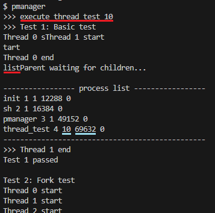

# [Project 2 WIKI]
[Notion](https://lacoruna.notion.site/Project-2-WIKI-2019019043-786627ee967e4d688b37cf520d1a579b)으로도 볼 수 있습니다 :)  


# [Design]

project2를 수행하며 설계한 디자인을 **Process Management**와 **LWP**의 두 부분으로 나누어 서술하였다.

## 1. Process Management (pmanager)


xv6에 기존에 없던 process 관리 기능들을 추가한다. 설계된 관리 기능들은 system call로 호출이 가능하게 한다.

### • Process with various stack size

stack page를 여러 개 할당받을 수 있게 하는 system call인 `int exec2(char *path, char **argv, int stacksize)`을 구현한다. 이는 새로운 소스파일 `exec2.c`를 생성하여 구현할 예정이다.

기존 소스파일 `exec.c`를 참고하고, 기존 `exec()`에 stack page의 개수를 지정할 수 있는 기능을 추가하여 구현한다.

또한 process를 나타내는 구조체 `proc`에 stack page 개수를 나타내는 `uint stacknum`를 추가한다.

```c
// proc.h

struct proc {
	/* 생략 */
  uint stacknum; // the number of stack page ( not including guard page )
	/* 생략 */
};
```

### • Process memory limitation

소스파일 `proc.c` 내부에 **특정 프로세스에 대해 할당받을 수 있는 메모리의 최대치를 제한하는** 함수 `int setmemorylimit(int pid, int limit)`를 구현한다. 

설정된 메모리 제한은 구조체 `proc`에 `uint sz_limit`으로 나타낸다.

이후에 `growproc()`를 통해 process의 memory size를 증가시키려고 할 때, `checkmemorylimit()`를 호출하여 제한 범위내의 변경인지 확인 후 memory size를 증가시킨다.

```c
// defs.h
int             checkmemorylimit(struct proc*, uint);
int             setmemorylimit(int, int);
```

```c
// proc.h

struct proc {
	/* 생략 */
  uint sz;                     // Size of process memory (bytes)
  uint sz_limit;               // Max size of process memory (bytes)
	/* 생략 */
};
```

### • Process manager

process를 관리할 user program인 **pmanager**을 만들기 위해, 소스파일 `pmanager.c`를 생성한다. 작동 방식은 `sh.c`를 참고하였다.

사용자가 명령어(command)를 입력하면, `parsecmd()`를 통해 명령어의 정보를 담는 구조체`pmgrcmd`가 생성되고, `runPmgrCmd()`가 생성된 구조체를 바탕으로 수행해야하는 기능을 수행한다.  이러한 작동 방식은 아래의 `main`함수의 코드를 보면 확인할 수 있다.

```c
// pmanager.c

/* 생략 */

struct pmgrcmd {
  int type;
};

/* 생략 */

int getPmgrCmd(char *buf, int nbuf);
struct pmgrcmd* parsecmd(char *s);
void runPmgrCmd(struct pmgrcmd *cmd);

int main(int argc, char *argv[])
{
  static char buf[100];

  // Read and run input commands.
  while(getPmgrCmd(buf, sizeof(buf)) >= 0){
    runPmgrCmd(parsecmd(buf));
  }
  exit();
}

/* 생략 */
```

## 2. LWP (thread API)


**Light-wight process (LWP)**는 다른 LWP와 자원과 주소 공간 등을 공유하여, 유저 레벨에서는 멀티태스킹을 가능하게 해주는 개념이다. 본 project에서는 **thread**기능을 하는 **LWP구현**을 목표로 한다.

따라서 thread도 하나의 process처럼 취급할 수 있도록 디자인하였다. 반대로 말하자면, process도 thread와 크게 구분되지 않는다. process가 처음 생성될 때, 그 process 자체를 main thread로 칭하며, main thread에서 thread_create()를 통해 생성된 thread를 child_thread라고 칭한다.

### • Light-weight process (thread)

process를 나타내는 구조체 proc의 멤버 변수로, 구조체 `thread_info_t`의 `thread_info`를 선언해주었다.

구조체 thread_info_t는 멤버 변수로 thread의 id를 나타내는 `thread_id`, 생성된 thread의 개수인 `thread_num`, `thread_exit()`으로 반환될 반환 값의 주소인 `retval`, main thread의 주소를 가리키는 `main_thread`가 있다.

main thread의 경우 `thread_id`가 0으로 설정되고, `thread_num`의 정보가 유효하다.
반면, 다른 child thread의 경우 `thread_id`는 0이 아닌 양수 값이고, `thread_num`의 정보는 유효하지 않다.

`proc`구조체의 멤버 변수 `sz`의 경우, 모든 thread들을 포함한 memory size를 나타낸다.

```c
//types.h
typedef unsigned int thread_t;
```

```c
// proc.h
struct thread_info_t {
  thread_t thread_id;
  uint thread_num;
  void* retval;
  struct proc *main_thread;
};

// Per-process state
struct proc {
	uint sz;                     // Size of process memory (bytes)
	/* 생략 */
  struct thread_info_t thread_info;
};
```

### • thread의 parent와 child

- 새로 생성된 child thread의 경우 main thread의 parent를 자신의 parent로 설정한다.
- thread A에서 fork를 통해 생성된 process B의 경우, B는 parent를 그 thread A로 설정한다.
    - 만약 A가 thread_exit로 종료될 시, B의 parent는 A의 main thread로 옮겨진다.
    - 만약 thread A가 속한 process 자체가 종료될 시, B의 parent는 init으로 옮겨진다.

### • thread id와 t_lock

thread들의 thread id는 main thread의 경우 0으로 설정되고, child thread의 경우 1부터 증가하며 설정된다. pid와 마찬가지로 `proc.c`의 전역변수(`int nexttid`)를 통해 다음 thread id의 값이 결정되고, 따라서 다른 process간의 thread들 간에도 thread id가 겹치는 경우가 없다. thread id를 할당하거나 간섭받지 않아야 하는 thread 정보 수정 시 이용할 lock인 `struct spinlock t_lock`를 추가했다.

```c
// proc.c
struct {
  struct spinlock lock;
  struct spinlock t_lock;
  struct proc proc[NPROC];
} ptable;

/* 생략 */

int nextpid = 1;
int nexttid = 1;
```

### • thread API

다음은 system call로 user program에서 사용할 수 있도록 구현될 함수들이다. `proc.c`에 해당 기능을 수행하는 함수들을 구현하고, `sysproc.c`에 wrapper function을 구현한다.

```c
int thread_create(thread_t *thread, void *(*start_routine)(void *), void *arg);
void thread_exit(void *retval);
int thread_join(thread_t thread, void **retval);
```

### • process 총 개수 증가

기존에 64로 설정된 최대 process 개수를 10000으로 증가시켜주었다.

thread도 결국 process취급을 하기 때문에, 여러 process에서 thread를 생성하면 64개로는 금방 자리가 부족할 것 같아서, 10000개로 증가시켜주었다. 작은 운영체제인 xv6에서는 이 정도 최대치면 충분할 것으로 생각된다.

```c
// param.h
#define NPROC      10000  // maximum number of processes
/* 생략 */
```

# [Implement]


다음에서는 Design 파트에 기재된 내용을 바탕으로 구현된 실제 코드를 분석한다.

## 1-1. Process Management (system call과 그 외 함수들)


process management를 위한 system call과 그 외의 함수들에 대한 설명이다.

- [exec2()](https://www.notion.so/Project-2-WIKI-2019019043-786627ee967e4d688b37cf520d1a579b?pvs=21) in `exec.c`
- [setmemorylimit()](https://www.notion.so/Project-2-WIKI-2019019043-786627ee967e4d688b37cf520d1a579b?pvs=21) in `proc.c`
- [checkmemorylimit()](https://www.notion.so/Project-2-WIKI-2019019043-786627ee967e4d688b37cf520d1a579b?pvs=21) in `proc.c`
- [proclist()](https://www.notion.so/Project-2-WIKI-2019019043-786627ee967e4d688b37cf520d1a579b?pvs=21) in `proc.c`
- [fork() with memory size limit and stack size](https://www.notion.so/Project-2-WIKI-2019019043-786627ee967e4d688b37cf520d1a579b?pvs=21) in `proc.c`

### • exec2()

**stack page의 개수를 지정하여 process를 실행하는 함수** `exec2()` 는 소스파일 `exec2.c`에 구현되어 있다. `exec.c`의 `exec()`를 참고하여 stack page의 개수를 지정할 수 있는 기능을 추가하였다.

아래의 코드는 `exec()`과 달라진 `exec2()`의 부분이다. 이를 토대로 다음을 확인할 수 있다.

- `stacksize`(stack page의 개수)는 1~100 범위 내로 설정이 가능하다.
- `allocuvm()`를 통해 인자로 받은 `stacksize`개수 만큼의 stack page를 할당하고, 추가로 guard page를 하나 할당한다.

`exec2()`도 `exec()`와 마찬가지로 system call로 동작가능하여야 한다. 따라서 `sysfile.c`에 wrapper funciton인 `sys_exec2()`를 만들었다. 이는 `sys_exec()`와 매우 유사하고 인자 개수만 추가되었기 때문에, 추가의 설명은 생략하겠다.

```c
// exec.2

int
exec2(char *path, char **argv, int stacksize)
{
	/* 생략 */

	// stack size는 1~100 범위 내로 설정이 가능하다.
  if(stacksize < 1 || stacksize > 100){
    cprintf("exec2: fail\nThe number of stack page must be in 1~100.\n");
    return -1;
  }
  
	/* 생략 */

  // stacksize만큼의 스택용 페이지와 하나의 가드용 페이지를 할당한다.
  sz = PGROUNDUP(sz);
  if((sz = allocuvm(pgdir, sz, sz + (stacksize+1)*PGSIZE)) == 0) 
    goto bad;
  clearpteu(pgdir, (char*)(sz - (stacksize+1)*PGSIZE));
  sp = sz;

	/* 생략 */
}
```

### • setmemorylimit()

인자로 받은 `pid`에 해당하는 process의 memory size limit을 나타내는 멤버 변수 `sz_limit`를 인자로 받은 `limit`의 값으로 설정하고 0을 반환한다. `pid`에 해당하는 process가 없거나, 설정하려는 제한보다 이미 memory size가 크다면 설정을 실패하고 -1을 반환한다.

```c
// proc.c

// limit은 byte단위. 0 이상의 정수이며, 0인 경우 제한이 없음.
int
setmemorylimit(int pid, int limit)
{
  acquire(&ptable.lock);
  uint u_limit = (uint) limit;
  struct proc *p;
  struct proc *target_p = 0;

  // finding target process
  for(p = ptable.proc; p < &ptable.proc[NPROC]; p++){
    if(p->pid == pid){
      target_p = p;
      break;
    }
  }  

  // If there isn't target 
  // or its memory size is already bigger than limit,
  // then setting memory limit failed.
  if(target_p == 0 || target_p->sz > u_limit){
    release(&ptable.lock);
    return -1;
  }
  target_p->sz_limit = u_limit;  
	// 변경된 sz_limit을 child thread들에게도 update시켜줌.
	thread_update_proc_info(target_p);

  release(&ptable.lock);
  return 0;
}
```

다음은 system call 구현을 위한 wrapper function이다. 인자를 두개 받아서 setmemorylimit()을 호출한다. 만약 반환값이 -1이면 memory size limit 설정에 실패한 것이기 때문에, 이를 출력해 알리고 -1을 반환한다. memory size limit에 성공하면 0을 반환한다.

```c
// sysproc.c

int
sys_setmemorylimit(void)
{
  int pid, limit, result;
	if (argint(0,&pid)<0 || argint(1,&limit)<0)
		return 0;
	result = setmemorylimit(pid,limit);
  if(result == -1){
    cprintf("set memory limit failed.\n");
    return -1;
  }
  return 0;
}
```

### • checkmemorylimit()

함수 `checkmemorylimit()`는 인자로 받은 process `p`의 멤버 변수 `sz_limit`를 참조하여, 증가 시키려는 새로 추가할 사이즈 `newsz`가 memory size limit을 만족시키는지 확인하고, 만족한다면 1을, 그렇지 않다면 0을 반환하는 함수이다. `sz_limit`이 0이면 memory size에 대한 제한이 없는 것이다.

이 함수는 `growproc()`에서 process의 memory size를 증가시키려는 과정 전에 호출되어 memory size limit에 위반되지 않는지 검사한다. `growproc()`에서 process의 memory size를 감소시키는 과정은 memory size limit을 위반하지 않기 때문에 이 함수를 호출하지 않는다.

```c
// proc.c

// If ok, then return 1.
// If not ok, then return 0.
int
checkmemorylimit(struct proc* p, uint newsz)
{
  if(p->sz_limit == 0 || p->sz_limit > p->sz + newsz)
    return 1;
  return 0;
}
```

```c
// proc.c

// Grow current process's memory by n bytes.
// Return 0 on success, -1 on failure.
int
growproc(int n)
{
  /* 생략 */
  sz = curproc->sz;
  if(n > 0){
    if(checkmemorylimit(curproc, n)){ // check if the new size of memory exceed the memory limit of the process
      if((sz = allocuvm(curproc->pgdir, sz, sz + n)) == 0){
        release(&ptable.t_lock);
        return -1;
      }
    }
    /* 생략 */
  }
  curproc->sz = sz;
  /* 생략 */
  return 0;
}
```

### • proclist()

상태가 `RUNNABLE`, `RUNNING`, `SLEEPING`인 process들의 정보를 출력한다. main thread가 아닌 다른 child thread를 출력에서 제외하기 위해, `(p->thread_info.thread_id==0)`의 조건을 만족하는 process만을 출력한다.

출력되는 정보는 프로세스의 **이름, pid, 스택용 페이지의 개수, (모든 thread를 고려한) 할당받은 메모리의 크기, 메모리의 최대 제한**이 있다.

`p->sz`는 해당 process의 모든 thread를 포함한 memory size를 나타낸다.

```c
// proc.c

void
proclist(void)
{
  struct proc *p;
  acquire(&ptable.lock);
  cprintf("----------------- process list -----------------\n");

  for(p = ptable.proc; p < &ptable.proc[NPROC]; p++){
    if((p->state == RUNNABLE || p->state == RUNNING || p->state == SLEEPING) && (p->thread_info.thread_id==0)){
      cprintf("%s %d %d %d %d\n", p->name, p->pid, p->stacknum, p->sz, p->sz_limit);
      //프로세스의 이름, pid, 스택용 페이지의 개수,
			//(모든 thread를 고려한) 할당받은 메모리의 크기, 메모리의 최대 제한
    }
  }  

  cprintf("------------------------------------------------\n");
  release(&ptable.lock);
  return;
}
```

```c
// sysproc.c

int
sys_proclist(void)
{
	proclist();
  return 1;
}
```

### • fork() with memory size limit and stack size

기존에 있던 fork()를 다음과 같이 멤버 변수 sz_limit과 stacknum도 복제하도록 수정하였다.

```c
int
fork(void)
{
	/* 생략 */
  np->sz_limit = curproc->sz_limit;
  np->stacknum = curproc->stacknum;
	/* 생략 */
}
```

## 1-2. Process Management (pmanager)


다음은 user program ‘pmanager’의 구현에 대한 설명이다.

- [pmanager.c](https://www.notion.so/Project-2-WIKI-2019019043-786627ee967e4d688b37cf520d1a579b?pvs=21)
- [pmanager.c - 명령어 구조체](https://www.notion.so/Project-2-WIKI-2019019043-786627ee967e4d688b37cf520d1a579b?pvs=21)
- [pmanager.c - 보조 함수](https://www.notion.so/Project-2-WIKI-2019019043-786627ee967e4d688b37cf520d1a579b?pvs=21)
- [pmanager.c - getPmgrCmd()](https://www.notion.so/Project-2-WIKI-2019019043-786627ee967e4d688b37cf520d1a579b?pvs=21)
- [pmanager.c - parsecmd()](https://www.notion.so/Project-2-WIKI-2019019043-786627ee967e4d688b37cf520d1a579b?pvs=21)
- [pmanager.c - runPmgrCmd()](https://www.notion.so/Project-2-WIKI-2019019043-786627ee967e4d688b37cf520d1a579b?pvs=21)

### • pmanager.c

pmanager.c는 user program인 pmanager를 위한 소스코드가 담겨있는 소스파일이다.
[ • Process manager](https://www.notion.so/Process-manager-6aea259765aa4a74be6163542acea3ca?pvs=21) 에서 살펴봤 듯이 sh.c의 동작을 모방하여 구현하였다.

간단한 보조 함수들은 묶어서 간략하게 설명하고, 동작의 핵심 부분들에 집중하여 설명하겠다.

### • pmanager.c - 명령어 구조체

**Design**파트에서 설명하였 듯이, `parsecmd()`를 통해 명령어의 정보를 담는 구조체`pmgrcmd`가 생성되고, `runPmgrCmd()`가 생성된 구조체를 바탕으로 수행해야하는 기능을 수행한다.

`parsecmd()` 내부에서는 명령어에서 사용하는 인자의 개수에 따라, 각 구조체 `cmdarg0`, `cmdarg1`, `cmdarg2`로 동적으로 생성되고, 생성된 구조체의 주소가 구조체 `pmgrcmd`의 주소 타입으로 캐스팅 되어서 전달된다. 각 구조체에 있는 멤버변수 `type`은 명령어의 종류를 나타내고, 이는 매크로로 -1 ~ 5의 값으로 지정해주었다. `EXEC1`과 `SBRK`는 test를 위해 추가로 설정해두었다.

```c
// pmanager.c

#define WRONGARG  -1
#define WRONGCMD  0
#define LIST  1
#define KILL 2
#define EXEC  3
#define MEMLIM  4
#define EXIT  5
#define EXEC1  6 // ! for debug
#define SBRK  7 // ! for debug

#define MAXARGLENGTH 51

#define WHITESPACE " \t\r\n\v"

struct pmgrcmd {
  int type;
};

struct cmdarg0 {
  int type;
};

struct cmdarg1 {
  int type;
  const char *arg;
};

struct cmdarg2 {
  int type;
  const char *arg1;
  const char *arg2;
};
```

### • pmanager.c - 보조 함수

- `skipWhitespace()`
    - 문자열에서 공백을 건너뛰도록 해주는 함수이다. `getWord()`에서 호출된다.
    
    ```c
    // pmanager.c
    
    #define WHITESPACE " \t\r\n\v"
    
    /* 생략 */
    
    // skip the whitespace, so move to the front of the next word.
    void
    skipWhitespace(char ** s, char * es)
    {
      while(*s < es && strchr(WHITESPACE, **s)){
        (*s)++;
      }
      return;
    }
    ```
    
- `getWord()`
    - 문자열에서 가장 앞의 단어를 가져오는 함수이다. `parsecmd()`에서 문자열에서 명령어를 parsing하기 위해서 사용된다.
    
    ```c
    // Get the front word from string. if there is some whitespace, ignore it.
    char *
    getWord(char ** s, char * es)
    {
      // skip whitespace
      skipWhitespace(s,es);
    
      // get a word (till reach whitespace)
      char *arg = malloc(sizeof(char)*MAXARGLENGTH);
      memset(arg, 0, sizeof(char)*MAXARGLENGTH);
      char * ss = *s;
      while(*s < es && !strchr(WHITESPACE, **s)){
          (*s)++;
      }
      **s = 0; // 문자열 끝에 널문자 추가
      (*s)++;
      strcpy(arg, ss);
      return arg;
    }
    ```
    
- `alloc_cmdarg0()`, `alloc_cmdarg1()`, `alloc_cmdarg2()`
    - parsing된 command의 type과 argument를 인자로 받아서 명령어 구조체를 생성하는 함수이다. 인자 설정에 문제가 있을 시, command의 type을 `WRONGARG`로 설정한다. 생성된 구조체의 주소를 `struct pmgrcmd *`로 캐스팅해서 반환된다. 다음은 `alloc_cmdarg2()`의 코드이다.
    
    ```c
    struct pmgrcmd*
    alloc_cmdarg2(int type, const char *arg1, const char *arg2)
    {
      struct cmdarg2 *cmd;
      cmd = malloc(sizeof(*cmd));
      memset(cmd, 0, sizeof(*cmd));
    
      // if argument is wrong
      if(strcmp(arg1,"")==0 || strcmp(arg2,"")==0){
        cmd->type = WRONGARG;
        cmd->arg1 = 0;
        cmd->arg2 = 0;
      }
      // if argument is correct
      else {
        cmd->type = type;
        cmd->arg1 = arg1;
        cmd->arg2 = arg2;
      }
    
      return (struct pmgrcmd*)cmd;
    }
    ```
    

### • pmanager.c - getPmgrCmd()

사용자로부터 터미널을 통하여 명령어를 입력받는 함수이다.

```c
// get one pmanager command
int
getPmgrCmd(char *buf, int nbuf)
{
  printf(2, ">>> ");
  memset(buf, 0, nbuf);
  gets(buf, nbuf);
  if(buf[0] == 0) // EOF
    return -1;
  return 0;
}
```

### • pmanager.c - parsecmd()

command를 문자열의 인자로 받아서 parsing하고 명령어 구조체를 생성한 후, 그 구조체의 주소를 반환하는 함수이다. 앞서 설명한 보조 함수들을 이용한다.

`strcmp()`를 호출하여 명령어의 종류를 결정짓는 첫 글자를 읽어 비교한 후, 조건문을 통해 각 종류에 맞는 명령어 구조체를 생성한다.

```c
// parse command and return structure pmgrcmd pointer.
struct pmgrcmd*
parsecmd(char *s)
{
  char *es; // end of string
  char *commandName;
  struct pmgrcmd *pmgrcmd = 0;

  es = s + strlen(s);

  // 어떤 명령어인지 확인
  commandName = getWord(&s,es);
  // list
  if (strcmp(commandName,"list")==0){
    pmgrcmd = alloc_cmdarg0(LIST);
  }

  // kill
  else if (strcmp(commandName,"kill")==0){
    // parsing into argument
    char *arg = getWord(&s,es);
    pmgrcmd = alloc_cmdarg1(KILL,arg);
  }

  // execute
  else if (strcmp(commandName,"execute")==0){
    // parsing into argument
    char *arg1 = getWord(&s,es);
    char *arg2 = getWord(&s,es);
    pmgrcmd = alloc_cmdarg2(EXEC,arg1,arg2);
  }

  // memlim
  else if (strcmp(commandName,"memlim")==0){
    // parsing into argument
    char *arg1 = getWord(&s,es);
    char *arg2 = getWord(&s,es);
    pmgrcmd = alloc_cmdarg2(MEMLIM,arg1,arg2);
  }

  // exit
  else if (strcmp(commandName,"exit")==0){
    pmgrcmd = alloc_cmdarg0(EXIT);
  }

  // ! for debug
  // execute1
  else if (strcmp(commandName,"exec1")==0){
    // parsing into argument
    char *arg = getWord(&s,es);
    pmgrcmd = alloc_cmdarg1(EXEC1,arg);
  }

  // ! for debug
  // debug command
  else if (strcmp(commandName,"sbrk")==0){
    pmgrcmd = alloc_cmdarg0(SBRK);
  }

  // wrong command
  else {
    pmgrcmd = alloc_cmdarg0(WRONGCMD);
  }

  return pmgrcmd;
}
```

### • pmanager.c - runPmgrCmd()

`parsecmd()`를 통해 생성된 명령어 구조체(의 주소)를 인자로 받아와서, 실제로 기능을 수행하는 함수이다. 전달받은 명령어 구조체의 멤버 변수 `type`을 참조하여 switch case문을 통해 해당하는 종류의 명령어 기능을 수행한다.

`type`이 `WRONGCMD`와 `WRONGARG`인 경우는 사용자가 command를 잘못 입력했을 때의 예외 처리를 위한 경우이다.

각 경우에서 인자를 알맞은 자료형으로 변환시키고, 팔요한 system call을 호출하여 해당 기능을 수행한다.  그 후, 사용한 명령어 구조체는 `free()`를 통해 반환시킨다.

명령어가 ‘execute’인 경우 (`type`이 `EXEC`인 경우), `fork()`를 통해 복제된 새로운 process에서 `exec2()`를 호출한다. 이를 통해 `exec2()`로 생성된 process가 종료됨을 기다리지 않고 pmanager가 독립적으로 계속 실행될 수 있다. 만약 `exec2()`이 정상적으로 실행이 안 되었을 경우, system call 내부에서 실패를 알리게 되고, `exit()`를 호출해 `fork()`로 복제된 process를 종료한다.

```c
// Execute pmanger cmd.
void
runPmgrCmd(struct pmgrcmd *pmgrcmd)
{
  
  struct cmdarg1 *cmd1;
  struct cmdarg2 *cmd2;
  
  int pid;
  int limit;
  char * path;
  char ** argv;
  int stacksize;
  
  switch(pmgrcmd->type){
  default:
    break;

  // 명세 외의 command를 입력했을 때 예외처리
  case WRONGCMD:
    printf(1,"wrong command.\n");
    free(pmgrcmd);
    break;

  // 인자를 잘못 입력했을 때 예외처리
  case WRONGARG:
    printf(1,"wrong argument.\n");
    free(pmgrcmd);
    break;

  case LIST:
    proclist();
    free(pmgrcmd);
    break;

  case KILL:
    cmd1 = (struct cmdarg1 *) pmgrcmd;
    pid = atoi(cmd1->arg);
    if(pid == 0){
      printf(1,"You can't kill the process with pid:0.\n");
    }
    else if (kill(pid) == -1){
      printf(1,"killing process whose pid is %d failed.\n",pid);
    }
    else{
      printf(1,"killing process whose pid is %d successed.\n",pid);
    }
    free(cmd1);
    break;

  case EXEC:
    cmd2 = (struct cmdarg2 *) pmgrcmd;

    path = (char *) cmd2->arg1;
    argv = &path;
    stacksize = atoi(cmd2->arg2);

    if(fork() == 0){
      exec2(path,argv,stacksize);
      // If exec2 failed, then the forked process exit.
      exit();
    }

    free(cmd2);
    break;

  case MEMLIM:
    cmd2 = (struct cmdarg2 *) pmgrcmd;
    pid = atoi(cmd2->arg1);
    limit = atoi(cmd2->arg2);
    if(pid == 0){
      printf(1,"You can't set the memory limit of the process with pid:0.\n");
    }
    else if(setmemorylimit(pid,limit) == 0)
      printf(1,"set memory limit succeed.\n");

    free(cmd2);
    break;

  case EXIT:
    printf(1,"pmanager exit\n");
    free(pmgrcmd);
    exit();
    break;

  // ! for debug
  case EXEC1:
    cmd1 = (struct cmdarg1 *) pmgrcmd;

    printf(1,"[debug command] exec1: %s\n",cmd1->arg);

    path = (char *) cmd1->arg;
    argv = &path;

    if(fork() == 0){
      exec(path,argv);
      // If exec1 failed, then the forked process exit.
      exit();
    }
    free(cmd1);
    break;

  // ! for debug
  case SBRK:
    printf(1,"[debug command] sbrk(500) with current process.\n");

    sbrk(500);
    free(pmgrcmd);
    break;

  }
  return;
}
```

## 2-1. LWP (thread API)


다음은 user program에서 지원할 thread API와, 이를 위해 같이 구현된 함수들에 대한 설명이다.

- [allocthread()](https://www.notion.so/Project-2-WIKI-2019019043-786627ee967e4d688b37cf520d1a579b?pvs=21)
- [thread_init()](https://www.notion.so/Project-2-WIKI-2019019043-786627ee967e4d688b37cf520d1a579b?pvs=21)
- [thread_update_proc_info()](https://www.notion.so/Project-2-WIKI-2019019043-786627ee967e4d688b37cf520d1a579b?pvs=21)
- [thread_create()](https://www.notion.so/Project-2-WIKI-2019019043-786627ee967e4d688b37cf520d1a579b?pvs=21)
- [thread_exit()](https://www.notion.so/Project-2-WIKI-2019019043-786627ee967e4d688b37cf520d1a579b?pvs=21)
- [all_child_thread_zombie()](https://www.notion.so/Project-2-WIKI-2019019043-786627ee967e4d688b37cf520d1a579b?pvs=21)
- [thread_join()](https://www.notion.so/Project-2-WIKI-2019019043-786627ee967e4d688b37cf520d1a579b?pvs=21)

### • allocthread()

기존의 allocproc()을 참고하여, ptable의 proc배열에서 thread를 하나 만들어 반환하는 함수를 구현하였다. 이후에 설명할 thread_create()의 내부에서 호출된다.

대부분 기존 allocproc()과 동일하며 추가된 부분은 다음과 같다.

- pid를 인자로 받은 main_thread의 것과 같게 설정한다.
- thread_init을 통해 새로 생성된 thread의 thread정보들을 초기화 해준다.
- thread_id를 얻고, 멤버 변수 main_thread를 인자로 받은 main_thread로 설정해준다. 이는 중복된 id를 받지 않게, t_lock을 얻고 실행한다.

```c
// allocproc과 유사하게 thread로 사용할 proc할당.
static struct proc*
allocthread(struct proc* main_thread)
{

	/* 생략 */

found:
  p->state = EMBRYO;
  p->pid = main_thread->pid;
  thread_init(p);

  release(&ptable.lock);

  // thread_id 배정. main_thread 연결
  acquire(&ptable.t_lock);
  p->thread_info.thread_id=nexttid++;
  p->thread_info.main_thread= main_thread;
  release(&ptable.t_lock);

	/* 생략 */

  return p;
}
```

### • thread_init()

인자로 받은 process(혹은 thread)의 `thread_info`를 초기화해주는 함수이다.

```c
void
thread_init(struct proc *p){
  p->thread_info.thread_id = 0;
  p->thread_info.thread_num = 0;
  p->thread_info.retval = 0;
  p->thread_info.main_thread = 0;
  return;
}
```

### • thread_update_proc_info()

proc구조체의 내부 멤버 변수 값이 바뀌었을 때, 같은 process의 thread들도 변경된 정보를 업데이트 해주는 함수이다. 업데이트 해주는 정보는 `sz`, `sz_limit`, `parent`가 있다.

```c
//proc 내부 멤버 변수 값이 바뀌었을 때 같은 pid를 가진 thread들에게도 업데이트 해주는 함수
void
thread_update_proc_info(struct proc * curproc)
{
  int pid = curproc->pid;
  thread_t tid = curproc->thread_info.thread_id;
  struct proc * t;
  for(t = ptable.proc; t < &ptable.proc[NPROC]; t++){
    if(t->pid == pid && t->thread_info.thread_id != tid){
      t->sz = curproc->sz;
      t->sz_limit = curproc->sz_limit;
      t->parent = curproc->parent;
    }
  }
  return;
}
```

### • thread_create()

`thread_create()`는 thread를 생성하는 API이다. 다음은 실행과정을 코드 순으로 설명하였다.

1. `allocthread()`를 호출하여 `ptable`의 `proc`배열에 thread를 하나 생성하여 변수 `nt`에 가져온다.
2. `nt`가 main thread의 정보를 공유하도록 설정하여준다.
3. `nt→tf→eip`의 값을 `start_routine`로 설정하여, 생성된 thread가 `start_routine`에서 시작하도록 설정한다.
4. 열려 있는 파일과 작업 경로를 복사한다.
5. `safestrcpy()`를 통해 process이름을 복사한다.
6. 새로 생성된 thread의 stack을 할당해준다.
    - `exec()`에서 user stack을 할당해주는 부분을 참고하였다.
    - 인자로 받은 `arg`를 stack에 넣어주어, `start_routine`의 인자로 사용할 수 있도록 해준다.
7. `nt`의 `state`를 `RUNNABLE`로 설정하여, 실행 가능한 상태로 만들어준다.
8. 생성된 thread의 thread id를 인자로 받은 `thread`에 저장한다.
9. main thread의 `thread_num` 정보를 1 증가시켜 갱신한다.

wrapper function은 `sysproc.c`에 구현하였으며, 특별한 내용이 없기 때문에 설명을 생략하였다.

```c
// Create a new thread copying current process as the main thread.
int
thread_create(thread_t *thread, void *(*start_routine)(void *), void *arg)
{
  int i;
  struct proc *nt;
  struct proc *main_thread = myproc()->thread_info.main_thread;

  // Allocate process.
  if((nt = allocthread(main_thread)) == 0){
    return -1;
  }
  
  acquire(&ptable.t_lock);
  nt->pgdir = main_thread->pgdir;
  nt->sz = main_thread->sz;
  nt->sz_limit = main_thread->sz_limit;
  nt->stacknum = main_thread->stacknum;
  nt->parent = main_thread->parent;
  *nt->tf = *main_thread->tf;
  nt->tf->eax = 0;

  // trapframe의 eip를 start_routine으로 설정하여,
  // 생성된 thread의 시작 지점을 start_routine으로 설정한다.
  nt->tf->eip = (uint)start_routine;

  for(i = 0; i < NOFILE; i++)
    if(main_thread->ofile[i])
      nt->ofile[i] = filedup(main_thread->ofile[i]);
  nt->cwd = idup(main_thread->cwd);

  safestrcpy(nt->name, main_thread->name, sizeof(main_thread->name));

  
  // Allocate two pages at the next page boundary.
  // Make the first inaccessible.  Use the second as the user stack.
  uint sz, sp, ustack[3];
  sz = PGROUNDUP(nt->sz);
  if((sz = allocuvm(nt->pgdir, sz, sz + 2*PGSIZE)) == 0)  
    cprintf("error: stack 할당\n");
  clearpteu(nt->pgdir, (char*)(sz - 2*PGSIZE)); // 가드페이지 생성
  sp = sz;
  nt->sz = sz;
  main_thread->sz = sz;
  thread_update_proc_info(nt);

  ustack[0] = 0xffffffff;  // fake return PC
  ustack[1] = (uint) arg;  // 인자 전달

  sp -= (2) * 4;
  if(copyout(nt->pgdir, sp, ustack, 8) < 0)
    cprintf("error: stack 값 복사\n");

  nt->tf->esp = sp;

  release(&ptable.t_lock);

  acquire(&ptable.lock);
  nt->state = RUNNABLE;
  release(&ptable.lock);

  *thread = nt->thread_info.thread_id;
  main_thread->thread_info.thread_num++;

  return 0;
}
```

### • thread_exit()

`thread_exit()`는 thread를 종료하는 API이다.

기존에 있는 `exit()`을 참고하여 구현하였다. 다음은 실행과정을 코드 순으로 설명하였다.

1. 열려 있는 file들과 현재 작업 디렉토리를 닫는다.
2. `wakeup1()`을 호출하여, join하고 있는 thread가 있다면 깨워준다.
3. 현재 process 구조체의 멤버 변수 `retval`에, 인자로 받은 `retval`을 넘겨준다. 이는 `thread_join()`에서 다시 받아가게 된다.
4. thread가 child process를 갖고 있었다면, 그 child process의 parent를 main thread로 옮겨준다.
5. 현재 thread의 상태를 `ZOMBIE`로 만들어준다.
6. main thread의 `thread_num`을 1 감소시켜 갱신한다.

wrapper function은 `sysproc.c`에 구현하였으며, 특별한 내용이 없기 때문에 설명을 생략하였다.

```c
void
thread_exit(void *retval)
{
  struct proc *curproc = myproc();
  struct proc * p;
  int fd;

  // Close all open files.
  for(fd = 0; fd < NOFILE; fd++){
    if(curproc->ofile[fd]){
      fileclose(curproc->ofile[fd]);
      curproc->ofile[fd] = 0;
    }
  }

  // cwd(현재 작업 디렉토리) 닫기
  begin_op();
  iput(curproc->cwd);
  end_op();
  curproc->cwd = 0;

  acquire(&ptable.lock);

  // # join하고 있는 쓰레드가 있다면 깨워줌.
  wakeup1(curproc);

  // # join에서 받을 반환값 설정
  curproc->thread_info.retval = retval;

  // thread가 fork를 통해 child를 갖고 있었다면
  // Pass abandoned children to main thread.
  // (main_thread가 살아있기 때문에 init대신 main_thread로 넘겨줌.)
  for(p = ptable.proc; p < &ptable.proc[NPROC]; p++){
    if(p->parent == curproc){
      p->parent = curproc->thread_info.main_thread;
      if(p->state == ZOMBIE)
        wakeup1(curproc->thread_info.main_thread);
    }
  }

  // Jump into the scheduler, never to return.
  curproc->state = ZOMBIE;
  curproc->thread_info.main_thread->thread_info.thread_num--;
  sched();
  panic("zombie exit");
}
```

### • thread_join()

`thread_join()`는 `thread_exit()`을 통해 종료된 thread의 자원을 정리하고 반환값을 받는 API이다. 만약 해당 thread가 종료가 되기 전이라면, 종료가 될 때까지 기다렸다가 수행한다.

기존에 있는 `wait()`을 참고하여 구현하였다. 다음은 실행과정을 코드 순으로 설명하였다.

1. 인자로 받은 `thread`와 같은 thread를 찾을 때까지 반복하여 찾는다.
2. 만약 해당 thread를 발견했다면, 해당 thread의 상태가 ZOMBIE인지 아닌지에 따라 실행이 달라진다.
    1. 만약 `ZOMBIE`라면, 해당 thread의 자원을 모두 반납하고, `retval`를 전달한다. 기존 `wait()`과 다른 점이라면, `pgdir`은 main thread에서 공유받은 것이므로 따로 반납하지 않는다.
    2. 만약 `ZOMBIE`가 아니라면, `sleep()`을 호출하여 잠든다.

wrapper function은 `sysproc.c`에 구현하였으며, 특별한 내용이 없기 때문에 설명을 생략하였다.

```c
// Wait for a child thread to exit and return 0.
// Return -1 if this process has no thread.
int
thread_join(thread_t thread, void **retval)
{
  
  struct proc *p;
  int havethreads;
  struct proc *curproc = myproc();
  
  acquire(&ptable.lock);
  for(;;){
    // Scan through table looking for exited children.
    havethreads = 0;
    for(p = ptable.proc; p < &ptable.proc[NPROC]; p++){
      if(p->thread_info.thread_id != thread)
        continue; 
      if(p->pid != curproc->pid)
        panic("error: 다른 process의 thread를 기다리고 있다.");
      havethreads = 1;
      if(p->state == ZOMBIE){
        // Found one.
        kfree(p->kstack);
        p->kstack = 0;
        p->pid = 0;
        p->parent = 0;
        p->name[0] = 0;
        p->killed = 0;
        p->state = UNUSED;
        // # retval 전달
        *retval = (void *) p->thread_info.retval;
        release(&ptable.lock);
        return 0;
      } else {
        break;
      }
    }

    // No point waiting if we don't have the thread.
    if(!havethreads || curproc->killed){
      release(&ptable.lock);
      return -1;
    }

    // Wait for children to exit.  (See wakeup1 call in proc_exit.)
    sleep(p, &ptable.lock);  //DOC: wait-sleep
  }
}
```

## 2-2. LWP이 적용된 기존 함수들


다음은 thread가 생기면서 달라지게 된 기존 함수들의 변경점에 대하여 설명하였다.

- [allocproc() with thread](https://www.notion.so/Project-2-WIKI-2019019043-786627ee967e4d688b37cf520d1a579b?pvs=21)
- [exec() with thread](https://www.notion.so/Project-2-WIKI-2019019043-786627ee967e4d688b37cf520d1a579b?pvs=21)
    - [all_thread_exit_except_exec_thread()](https://www.notion.so/Project-2-WIKI-2019019043-786627ee967e4d688b37cf520d1a579b?pvs=21)
- [sbrk() with thread](https://www.notion.so/Project-2-WIKI-2019019043-786627ee967e4d688b37cf520d1a579b?pvs=21)
- [exit() with thread](https://www.notion.so/Project-2-WIKI-2019019043-786627ee967e4d688b37cf520d1a579b?pvs=21)
    - [all_child_thread_zombie()](https://www.notion.so/Project-2-WIKI-2019019043-786627ee967e4d688b37cf520d1a579b?pvs=21)

`fork()`, `sleep()`, `wait()`, `kill()`등은 추가적인 코드 수정 없이 잘 동작하도록 하였다.

### • allocproc() with thread

새로운 process를 만들 때, thread 정보를 초기화 해주기 위한 부분을 추가하였다. 새로운 process가 생성되면, 이는 main thread로 간주되기 때문에, `thread_init()`의 내부에서 멤버 변수 `thread_id`를 0으로 초기화해주고, 멤버 변수 `main_thread`는 자신으로 설정해준다.

```c
static struct proc*
allocproc(void)
{

	/* 생략 */

found:
  p->state = EMBRYO;
  p->pid = nextpid++;
  thread_init(p);
  p->thread_info.main_thread = p;

	/* 생략 */

  return p;
}
```

### • exec() with thread

`exec()`가 실행되면 하나의 thread에서 새로운 process가 시작되고 나머지 thread는 종료되도록 코드를 수정하였다. 이를 위해 `proc.c`에 함수 `all_thread_exit_except_exec_thread()`를 만들어 호출하였다. 또한 멤버 변수 구조체 `thread_info`도 초기화하는 부분을 추가하였다.

```c
// exec.c

int
exec(char *path, char **argv)
{
  /* 생략 */

  // # exec호출한 thread외에 다른 thread 종료
  all_thread_exit_except_exec_thread(curproc);

  // Commit to the user image.
  oldpgdir = curproc->pgdir;
  curproc->pgdir = pgdir;
  curproc->sz = sz;
  curproc->sz_limit = 0;
  curproc->stacknum = 1;
  curproc->tf->eip = elf.entry;  // main
  curproc->tf->esp = sp;
  // # thread_info 설정.
  curproc->thread_info.thread_id = 0;
  curproc->thread_info.thread_num = 0;
  curproc->thread_info.retval = 0;
  curproc->thread_info.main_thread = curproc;

  /* 생략 */
}
```

### • all_thread_exit_except_exec_thread()

`exec()`에서 자신을 제외한 다른 thread를 종료시키기 위해 호출되는 함수이다.

구조는 기존에 있는 `exit()`과 `wait()`을 합쳐서, 자원이 바로 반납되도록 만든 함수이다.

`proc`배열을 돌며 자신과 같은 process에 속한 thread를 찾아서 (물론 자신은 제외하고), 자원을 반납하며 종료시킨다. 기존 `wait()`에서 자원을 반납시키는 부분과 달리 `pgdir`은 반납시키지 않는다. 그 이유는 `exec()`에서 따로 해주기 때문이다.

```c
// proc.c

// process에서 exec를 호출하는 경우,
// exec를 호출하는 thread를 제외하고 전부 종료하기 위한 함수
// exec 내부에서 호출됨.
// 인자로 전달되는 thread가 main thread가 아닐 수 있음
void
all_thread_exit_except_exec_thread(struct proc * thread)
{
  int curproc_pid = thread->pid;
  int curproc_tid = thread->thread_info.thread_id;
  struct proc * main_thread = thread->thread_info.main_thread;
  int child_thread_num = main_thread->thread_info.thread_num;
  struct proc *p;
  struct proc *c;
  int fd;

  if(child_thread_num == 0){
    return;
  }
  // ! for debug
  else if(child_thread_num < 0){
    panic("thread exit more than create");
  }

  acquire(&ptable.lock);

  // finding worker thread
  for(p = ptable.proc; p < &ptable.proc[NPROC]; p++){
    if(p->pid == curproc_pid && p->thread_info.thread_id != curproc_tid){
      
      // Close all open files.
      release(&ptable.lock); //iput과 fileclose에서 ptable.lock을 씀.
      for(fd = 0; fd < NOFILE; fd++){
        if(p->ofile[fd]){
          fileclose(p->ofile[fd]);
          p->ofile[fd] = 0;
        }
      }
      begin_op();
      iput(p->cwd);
      end_op();
      p->cwd = 0;

      acquire(&ptable.lock);

      // thread가 fork를 통해 child를 갖고 있었다면
      // Pass abandoned children to init.
      for(c = ptable.proc; c < &ptable.proc[NPROC]; c++){
        if(c->parent == p){
          c->parent = initproc;
          if(c->state == ZOMBIE)
            wakeup1(initproc);
        }
      }

      acquire(&ptable.t_lock);
      kfree(p->kstack); //@
      p->kstack = 0;
      //pgdir은 exec에서 free해줄거기 때문에 따로 free 안해준다.
      p->pid = 0;
      p->parent = 0;
      p->name[0] = 0;
      p->killed = 0;
      thread_init(p);
      p->state = UNUSED;
      main_thread->thread_info.thread_num--;
      release(&ptable.t_lock);

      if(main_thread->thread_info.thread_num == 0)
        break;
    }
  }
  release(&ptable.lock);
  return;  
}
```

### • sbrk() with thread

process의 memory size 변경은 결국 `growproc()`를 통해 일어난다. 어느 thread에서 memory 크기를 변경시킬 때, 다른 thread에서 동시에 변경하지 못하도록 `t_lock`을 얻고 실행하도록 해주었다. 또한 멤버 변수 `sz`는 해당 process의 모든 thread를 고려한 size이므로, 다른 thread들도 정보가 업데이트 되도록 수정했다.

```c
// Grow current process's memory by n bytes.
// Return 0 on success, -1 on failure.
int
growproc(int n)
{
  uint sz;
  struct proc *curproc = myproc();

  acquire(&ptable.t_lock);
  sz = curproc->sz;
  if(n > 0){
    if(checkmemorylimit(curproc, n)){ // check if the new size of memory exceed the memory limit of the process
      if((sz = allocuvm(curproc->pgdir, sz, sz + n)) == 0){
        release(&ptable.t_lock);
        return -1;
      }
    }
    else {
      release(&ptable.t_lock);
      return -1;
    }
  } else if(n < 0){
    if((sz = deallocuvm(curproc->pgdir, sz, sz + n)) == 0){
      release(&ptable.t_lock);
      return -1;
    }
  }
  curproc->sz = sz;
  thread_update_proc_info(curproc);
  release(&ptable.t_lock);
  switchuvm(curproc);
  return 0;
}
```

### • exit() with thread

`exit()`호출 시 모든 thread가 종료되어야 한다. 따라서 기존에는 하나의 process만 종료시켰던 것과 달리, `exit()`를 호출한 thread의 모든 thread를 종료하도록 수정하였다.
이를 위해 `all_child_thread_zombie()`라는 함수를 만들어 호출하였다.

```c
void
exit(void)
{
  // exit가 호출되는 경우, 어떤 thread에서 호출되었는지 상관없이 모든 thread 종료.
  // 또한 하나의 thread가 kill 당하면, 모든 thread를 종료해야 하는 것도 일맥상통.

  // exit를 호출한 thread가 main thread가 아니더라도, 종료하는 것은 결국 main thread(process 자체)이다.
  // 따라서 종료하는 process를 main thread로 바꿔준다.
  struct proc *curproc = myproc()->thread_info.main_thread;

	/* 생략 */

  release(&ptable.lock);

  // # 자식 thread들을 정리해주기 위해 zombie로 변경.
  all_child_thread_zombie(curproc);

  // Jump into the scheduler, never to return.
  acquire(&ptable.lock);
  curproc->state = ZOMBIE;
  sched();
  panic("zombie exit");
}
```

### • all_child_thread_zombie()

해당 함수는 `exit()`호출 시 모든 thread의 상태가 `ZOMBIE`가 되도록 만드는 함수이다. 또한 그 과정에서 열려있던 파일들을 닫고, 현재 작업 디렉터리를 정리하며, 자신이 child를 가지고 있다면 그 child의 parent를 init으로 옮기는 작업을 수행한다.

```c
// process에서 exit호출 시, 자식 thread를 전부 zombie로 바꾸는 함수.
// exit 내부에서 호출 됨.
void
all_child_thread_zombie(struct proc * main_thread)
{
  int curproc_pid = main_thread->pid;
  int curproc_tid = main_thread->thread_info.thread_id;
  int child_thread_num = main_thread->thread_info.thread_num;
  struct proc *p;
  struct proc *c;
  int fd;

  if(child_thread_num == 0){
    return;
  }
  // ! for debug
  else if(child_thread_num < 0){
    panic("thread exit more than create");
  }

  acquire(&ptable.lock);

  // finding worker thread
  int cnt = 0;
  for(p = ptable.proc; p < &ptable.proc[NPROC]; p++){
    if(p->pid == curproc_pid && p->thread_info.thread_id != curproc_tid){
      
      // Close all open files.
      release(&ptable.lock); // # iput과 fileclose에서 ptable.lock을 씀.
      for(fd = 0; fd < NOFILE; fd++){
        if(p->ofile[fd]){
          fileclose(p->ofile[fd]);
          p->ofile[fd] = 0;
        }
      }
      begin_op();
      iput(p->cwd);
      end_op();
      p->cwd = 0;

      acquire(&ptable.lock);

      // Pass abandoned children to init.
      for(c = ptable.proc; c < &ptable.proc[NPROC]; c++){
        if(c->parent == p){
          c->parent = initproc; 
          if(c->state == ZOMBIE)
            wakeup1(initproc);
        }
      }
      p->state = ZOMBIE;

      if(child_thread_num == ++cnt)
        break;
    }
  }
  release(&ptable.lock);
  return;  
}
```

# [Result]

여러 process(혹은 thread)가 번갈아가며 실행되는 경우, 출력된 메세지가 섞여 읽기 힘들 것을 고려해 **입력한 명령어를 빨간 색**으로, **눈여겨 봐야할 부분을 다른 색**으로 체크해두었다.

## 1. Process Management (pmanager)

다음은 user program ‘pmanager’를 실행한 결과를 정리하였다.

### • execute




왼쪽의 실행 결과는 다음을 보여준다.

- pmanage 명령어 ‘list’를 통해 stack page의 개수를 확인할 수 있다. ( name, pid, stack page의 개수, memory size, memory size limit 순으로 출력된다. )
- pmanage 명령어 ‘execute’를 통해 stack page의 개수를 원하는 만큼 설정하여 process를 실행시킬 수 있다.
- `exec2()`를 통해 생성된 process (thread_test)는 `exec()`를 통해 생성된 process보다 stack page를 많이 할당해주었기 때문에 memory size가 더 크다.
- execute 명령어를 사용할 때, 생성된 process가 종료되는 것을 기다리지 않고 바로 다음 명령어를 사용할 수 있다. 왼쪽의 실행 결과에서는 thread_test가 실행되는 와중에 pmanager가 list 명령어를 수행하고 있다.

왼쪽의 실행에서 사용된 pmanager 명령어 ‘exec1’는 테스트를 위해 구현된 부가 기능이다. execute 명령어와 달리 `exec2()`를 호출하는 대신 `exec()`를 호출한다. ( [참고 링크](https://www.notion.so/Project-2-WIKI-2019019043-786627ee967e4d688b37cf520d1a579b?pvs=21) ) 

### • memlim


왼쪽의 실행 결과는 다음을 보여준다.

- pmanage 명령어 ‘list’를 통해 memory size와 memory size limit을 확인할 수 있다.
- pmanage 명령어 ‘memlim’를 통해 memory size limit을 설정할 수 있다.
- 설정된 memory size limit을 초과하도록 memory size를 늘릴 수 없다.

왼쪽의 실행에서 사용된 pmanager 명령어 ‘sbrk’는 테스트를 위해 구현된 부가 기능이다. system call `sbrk()`를 호출하여 memory size를 500bytes 늘린다. ( [참고 링크](https://www.notion.so/Project-2-WIKI-2019019043-786627ee967e4d688b37cf520d1a579b?pvs=21) ) 

### • kill


왼쪽의 실행 결과는 다음을 보여준다.

- pmanage 명령어 ‘kill’을 통해 해당 pid를 가진 process를 종료시킬 수 있다. ( pid가 4인 thread_test를 종료시킴 )
- pmanage 명령어 ‘list’를 통해 process의 정보 출력 시, 생성된 thread가 전부 표시되지 않고, main thread를 실행하는 process만 표시된다.

## 2. LWP (thread API)


다음은 thread API를 실행한 결과를 정리하였다.

piazza에 제공된 test code와 자체 제작 test program의  2가지 test가 있다.

### • piazza에 제공된 test code

다음은 thread_test, thread_exec, thread_exit, thread_kill을 통과한 실행 결과이다.


### • 자체 제작 test program - 소개

처음에는 여러 test code들을 만들었지만, 대부분 조교님께 제공받은 test code와 내용이 겹쳐서 2가지만 추려서 남겨두었다.

해당 test code는 user program으로 작동하기 위해 소스파일 `t_test.c`로 제작되었고, xv6와 함께 make 된다.

다음은 숫자를 선택 받아서 test를 선택하는 main문이다.

```c
int main(int argc, char *argv[])
{
  if(argc <= 1){
    printf(1,"Error: Insufficient arguments.\nPlease input 1~2\n");
    exit();
  }
  int test_num = atoi(argv[1]);
  switch(test_num){
    default:
      printf(1,"1~2까지의 옵션이 있습니다.\n");
      break;

    case 1:
      t_test_1();
      break;

    case 2:
      t_test_2();
      break;
  }
  exit();
}
```

### • 자체 제작 test program - test 1

다음은 user program ‘t_test’로 실행할 수 있는 t_test_1이다. thread에서 인자로 받은 값을 제대로 사용할 수 있는지, retval을 잘 전달하는지를 테스트한다.

thread 시작 함수인 `make77777()`은 인자로 받은 값에서 3695를 뺀다. 인자로 정확하게 81472를 받아왔다면, 계산 결과가 77777일 것이다.

또한 `make77777()`은 `tread_exit()`을 호출하며 학생의 학번을 넘겨주고 있다. 만약 제대로 넘겨주고 `thread_join()`에서 제대로 받았다면, main thread에서의 `retval`이 학번을 담고 있을 것이다.

그렇게 모두 정상적으로 작동됐다면 test를 통과했음을 출력한다.

실행결과를 보면 test를 정상적으로 통과했음을 알 수 잇다.

```c
int t_test_1()
{
  thread_t thread;
  int i=81472;

  thread_create(&thread,make77777,&i);

  int* retval;

  thread_join(thread, (void *) &retval);

  if(*retval == 2019019043 && i == 77777)
    printf(1,"argument and retval passing test passed!\n");
  exit();
}
```

```c
void *make77777(void *arg){
  int ret=2019019043;
  *(int *)arg -= 3695;
  thread_exit(&ret);
  printf(1,"이게 출력되면 안됨.\n");
  exit();
}
```


### • 자체 제작 test program - test 2

다음은 user program ‘t_test’로 실행할 수 있는 t_test_2이다. thread에서 파일을 열고 읽는 동작이 잘 작동하는지 확인하는 테스트이다.

이 테스트를 위해 소스파일 `init.c`에 ‘Ride the W-A-V-E’라는 문구를 담은 파일 ‘file.txt’를 생성하도록 코드를 추가하였다.

만약 thread에서 파일을 정상적으로 열어서 데이터를 정확히 얽었다면 ‘Ride the W-A-V-E’를 5번 출력할 것이다.

실행결과를 보면 문구를 5번 정상적으로 출력했고, 테스트를 통과했음을 알 수 잇다.

```c
// open test
int t_test_2()
{
  int i;
  thread_t tid[5];

  for (i = 0; i < 5; i++) {
    thread_create(&(tid[i]), worker_open, 0);
    sleep(50);
    if (tid[i] == -1) {
      printf(1, "Error creating thread\n");
      exit();
    }
  }

  for (i = 0; i < 5; i++) {
    thread_join(tid[i], 0);
  }

  printf(1,"WAVE를 5번 타면 test 통과한 것입니다.\n");
  exit();
}
```

```c
void *worker_open(void *arg)
{
  int fd;
  char buffer[256];
  int a = 1;

  // Open the file
  fd = open("file.txt", O_RDONLY);
  if (fd < 0) {
    printf(1, "Error opening the file\n");
    thread_exit(&a);
  }

  // Read and print the file contents
  int bytesRead = read(fd, buffer, sizeof(buffer));
  if (bytesRead < 0) {
    printf(1, "Error reading the file\n");
    thread_exit(&a);
  }
  printf(1, "File contents: %s\n", buffer);

  // Close the file
  close(fd);

  thread_exit(&a);
  exit();
}
```

```c
// init.c

int
main(void)
{
  int fd;

  // Create file.txt
  fd = open("file.txt", O_CREATE | O_WRONLY);
  if (fd < 0) {
    printf(1, "Error creating file.txt\n");
  } else {
  char *content = "Ride the W-A-V-E";
  write(fd, content, strlen(content));
  close(fd);
  }

	/* 생략 */
}
```


# [Trouble shooting]

다음은 project를 수행하면서 겪었던 문제들을 서술하였다.

## test code를 다 통과했더라도…

현재 주어진 test code들을 전부 통과하였기에, 구현을 끝마쳤다고 생각하고 wiki를 작성하는 중이었다. 하지만 wiki를 작성하면서 내 코드가 부족한 부분이 있다는 것을 계속 깨닫게 되었고, 수정을 거듭하며 위키를 작성해 나갔다.

project1을 하면서도 느낀점이지만, 짧은 시간 동안 생각해낸 test case들은 결국 모든 예외 상황을 대변할 수 없다. 시간이 지나고 다시 볼 때마다 내 코드의 부족했던 부분과 해주지 못한 예외처리들이 떠오른다. 앞으로 다른 project에 임할 때에도, 구현을 끝마쳤다고 안일하게 안주하는 것이 아닌, 다른 예외상황이 오랜 기간동안 곰곰히 생각해봐야겠다.

또한 test case를 통해 실행오류가 없더라도, 불필요한 작업을 반복하거나, 자원을 낭비하는 경우도 있었더라. 결국, 작성한 test case를 다 통과했다고 하더라도, 그것이 program의 개선점이 없다는 것은 아님을 명심해야겠다.