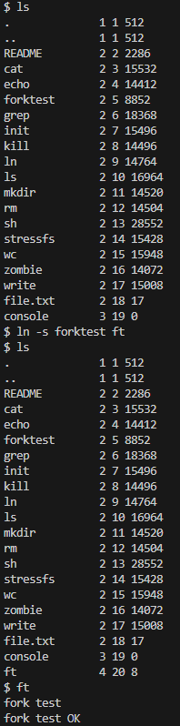

# [Project 3 WIKI] 2019019043 박종윤
[Notion](https://lacoruna.notion.site/Project-3-WIKI-2019019043-dc67e1b3271942c2bcbbe7adefc640af)으로도 볼 수 있습니다 :)  

# [Design]

project3를 수행하며 설계한 디자인을 **Multi Indirect**와 **Symbolic Link**의 두 부분으로 나누어 서술하였다.

## 1. Multi Indirect


기존 xv6는 single indirect 방식을 통해 파일의 정보를 저장한다. 이번 프로젝트에서는 xv6의 filesystem에 double indirect와 triple indirect기능을 구현해 기존보다 더 큰 용령의 파일을 다를 수 있도록 한다.

xv6에서는 inode(dinode)의 크기를 고정하고 있으므로 새로운 멤버 변수를 추가하지 않고 기존의 멤버 변수를 이용하여 구현해야한다. 기존에 inode와 dinode에서 사용하고 있던 멤버 변수 `addrs`는 data block address를 담는 `uint` 자료형의 13개의 원소를 가진 배열이다. 12개는 direct방식을 위해 사용되고, 1개는 single indirect를 위해 사용된다. 본 프로젝트에선 이 멤버 변수 `addrs`를 그대로 사용하되, 앞의 10개는 direct를 위해 , 뒤의 3개는 각각 single, double, triple indirect를 위해 사용되도록 변경할 것이다.

이를 위해 `fs.h`에 새로운 매크로를 지정해주었고, dinode와 inode의 `addrs`를 다음과 같이 변경해주었다. `addrs`의 원소 개수는 13개로 이전과 동일하다. `NINDIRECT`는 single indirect이 담을 수 있는 data block 개수를 나타낸다. 따라서 새로 설정해준 `NINDIRECT_D`와 `NINDIRECT_T`는 각각 `NINDIRECT`의 제곱과 세제곱이 된다. 그리고 `MAXFILE`은 direct와 indirect로 표현할 수 있는 전체 data block 개수로 다시 설정해준다.

```c
// fs.h

#define NDIRECT 10 // D_INDIRECT와 T_INDIRECT block을 위해 기존 12개에서 2개를 빼줌.
#define NINDIRECT (BSIZE / sizeof(uint))
#define NINDIRECT_D NINDIRECT * NINDIRECT
#define NINDIRECT_T NINDIRECT * NINDIRECT * NINDIRECT
#define MAXFILE (NDIRECT + NINDIRECT + NINDIRECT_D + NINDIRECT_T)

// On-disk inode structure
struct dinode {
  short type;           // File type
  short major;          // Major device number (T_DEV only)
  short minor;          // Minor device number (T_DEV only)
  short nlink;          // Number of links to inode in file system
  uint size;            // Size of file (bytes)
  uint addrs[NDIRECT+3];   // NDIRDECT for Data block addresses & (3) for single,double,triple indirect
};
```

```c
// file.h

// in-memory copy of an inode
struct inode {
	/* 생략 */
  uint addrs[NDIRECT+3]; // direct와 single,double,triple indirect
};
```

더 큰 파일을 다루기 위해서 `FSSIZE`도 수정하였다.

```c
// param.h
#define FSSIZE       2500000  // size of file system in blocks
```

bmap()은 인자로 받은 inode에서 인자로 받은 bn번째의 data block address를 반환하는 함수이다. double indirect와 triple indirect를 지원하도록 bmap()의 수정이 필요하다. 이는 Implement에서 살펴보도록 한다.

## 2. Symbolic Link


기존 xv6는 user program ln을 통하여 hard link를 지원한다. 이번 프로젝트에서는 symbolic link를 지원하도록 xv6를 수정한다.

기존 system call `link()`는 inode를 공유해서 사용하며, 링크 파일 생성 시 inode의 `nlink`변수를 증가시켜준다. 따라서 `nlink`를 확인하여 해당 inode를 취하는 파일의 개수를 알 수 있고, 해당 inode를 취하는 파일이 전부 없어졌을 시, 해당 inode를 비로서 삭제한다.

이번에 구현하는 symbolic link는 원본 파일 삭제 시, symbolic link 파일에서는 접근이 안되도록 해야하므로, `nlink`를 증가시키지 않도록 구현할 예정이다.

symbolic link는 inode의 data block에 원본 파일의 이름을 저장하고, 링크 파일 접근 시 이를 이용하여 원본 파일에 접근할 수 있도록 할 것이다.

symbolic link파일을 위하여 `stat.h`에 inode의 새로운 type을 생성해주었다.

```c
// stat.h
#define T_SYM  4   // symbolic link
```

# [Implement]


다음에서는 Design 파트에 기재된 내용을 바탕으로 구현된 실제 코드를 분석한다.

## 1. Multi Indirect


`bmap()`은 인자로 받은 inode(`ip`)에서 인자로 받은 `bn`번째의 data block address를 반환하는 함수이다. 기존에 direct와 single indirect만 지원하던 `bmap()`을 **double indirect와 triple indirect또한 지원하도록** 수정하여 하였다. 기존에 있던 single indirect에서 data block address를 가져오는 코드를 참고하여 쉽게 구현할 수 있었다. 동작 방식은 `bread()`를 통해 data block을 읽어온 후, 그것이 data block address를 저장하고 있는 indirect data block이었다면, direct data block을 접근할 때까지 `bread()`를 하는 방식이다.

```c
static uint
bmap(struct inode *ip, uint bn)
{
  uint addr, *a; // addr: 물리주소
  struct buf *bp;

  // # 접근하려는 block이 direct data 안에 있는지 확인
  if(bn < NDIRECT){ // block number가 12보다 작을 때는, direct로 전부 다 담긴다.
    if((addr = ip->addrs[bn]) == 0) // ip->addrs[bn]을 확인하여 물리주소를 가져옴. 만약 가져온 물리주소가 0이라면, 아직 디스크랑 맵핑이 안 되어있는 것임.
      ip->addrs[bn] = addr = balloc(ip->dev); // 매핑이 안되어 있으면 zeroed disk block을 balloc으로 가져옴.
    return addr;
  }
  bn -= NDIRECT;  // direct로 넘겨주고 남을 부분만 저장

  // # 접근하려는 block이 single indirect data 안에 있는지 확인
  // Load single indirect block, allocating if necessary.
  if(bn < NINDIRECT){

    // direct data block 다음에 이어지는 indirect block의 주소를 가져옴.
    if((addr = ip->addrs[NDIRECT]) == 0)
      ip->addrs[NDIRECT] = addr = balloc(ip->dev);
    
    bp = bread(ip->dev, addr); // single indirect data block을 읽음.
    a = (uint*)bp->data; // a는 single indirect data block의 data인, 실제 data block의 주소들의 집합
    if((addr = a[bn]) == 0){ // a[bn]은 접근하려는 data block의 주소. a[bn]이 0이면 disk랑 맵핑이 안 된 것.
      a[bn] = addr = balloc(ip->dev); // zeroed disk block을 할당해줌.
      log_write(bp);
    }
    brelse(bp);
    return addr;
  }
  bn -= NINDIRECT;

  // # 접근하려는 block이 double indirect data 안에 있는지 확인
  // Load double indirect block, allocating if necessary.
  if(bn < NINDIRECT_D){
    // # step 0) 각 indirect data block에서 접근할 idx 설정
    uint double_indirect_index = bn / NINDIRECT; // double indirect block entry들 중에서 접근할 data의 index
    uint single_indirect_index = bn % NINDIRECT; // s_indirect block의 data에서 접근할 addr의 idx

    // # step 1) double indirect block 접근해서 읽기
    // double indirect block에 접근
    uint double_indirect_block = ip->addrs[NDIRECT + 1]; // direct 다음에 이어지는 signle indirect 다음에 이어지는 double indirect block에 접근.
    if(double_indirect_block == 0) // double_indirect_block이 0이면 아직 mapping이 안 된 것.
      ip->addrs[NDIRECT + 1] = double_indirect_block = balloc(ip->dev);

    // double indirect block의 data 읽기
    bp = bread(ip->dev, double_indirect_block); // double indirect block을 읽어옴.
    uint *double_indirect_block_entries = (uint*)bp->data; // double indirect block의 data. 주소들의 모임들의, 주소들의 모임을 가지고 있음.

    // # step 3) single indirect block 접근해서 읽기
    // single indirect block에 접근
    uint single_indirect_block = double_indirect_block_entries[double_indirect_index]; // 접근할 d_indirect속 s_indirect
    if (single_indirect_block == 0) { // 접근하려는 block이 0이라면 새로 mapping
      double_indirect_block_entries[double_indirect_index] = single_indirect_block = balloc(ip->dev);
      log_write(bp);
    }
    brelse(bp);

    // single indirect block의 data 읽기
    bp = bread(ip->dev, single_indirect_block); // s_indirect block을 읽어옴.
    uint *single_indirect_block_entries = (uint*)bp->data;

    // # step 4) 접근하려고 했던 data block의 주소 가져오기
    // single indirect block에 접근
    if ((addr = single_indirect_block_entries[single_indirect_index]) == 0) {
      single_indirect_block_entries[single_indirect_index] = addr = balloc(ip->dev);
      log_write(bp);
    }
    brelse(bp);
    return addr;
  }

  bn -= NINDIRECT_D;

  // # 접근하려는 block이 triple indirect data 안에 있는지 확인
  // Load triple indirect block, allocating if necessary.
  if(bn < NINDIRECT_T){
    // # step 0) 각 indirect data block에서 접근할 idx 설정
    uint triple_indirect_index = bn / NINDIRECT_D; // triple indirect block entry들 중에서 접근할 data의 index
    uint double_indirect_index = (bn % NINDIRECT_D) / NINDIRECT; // triple indirect block entry들 중에서 접근할 data의 index
    uint single_indirect_index = (bn % NINDIRECT_D) % NINDIRECT; // triple indirect block entry들 중에서 접근할 data의 index

    // # step 1) triple indirect block 접근해서 읽기
    // triple indirect block에 접근
    uint triple_indirect_block = ip->addrs[NDIRECT + 2]; // direct 다음에 이어지는 signle indirect 다음에 이어지는 double indirect block에 접근.
    if(triple_indirect_block == 0){ // double_indirect_block이 0이면 아직 mapping이 안 된 것.
      ip->addrs[NDIRECT + 1] = triple_indirect_block = balloc(ip->dev);
    }

    // triple indirect block의 data 읽기
    bp = bread(ip->dev, triple_indirect_block); // triple indirect block을 읽어옴.
    uint *triple_indirect_block_entries = (uint*)bp->data; // triple indirect block의 data.

    // # step 2) double indirect block 접근해서 읽기
    // double indirect block에 접근
    uint double_indirect_block = triple_indirect_block_entries[triple_indirect_index]; // 접근할 d_indirect속 s_indirect
    if (double_indirect_block == 0) { // 접근하려는 block이 0이라면 새로 mapping
      triple_indirect_block_entries[triple_indirect_index] = double_indirect_block = balloc(ip->dev);
      log_write(bp);
    }
    brelse(bp);

    // double indirect block의 data 읽기
    bp = bread(ip->dev, double_indirect_block); // s_indirect block을 읽어옴.
    uint *double_indirect_block_entries = (uint*)bp->data;

    // # step 3) single indirect block 접근해서 읽기
    // single indirect block에 접근
    uint single_indirect_block = double_indirect_block_entries[double_indirect_index]; // 접근할 d_indirect속 s_indirect
    if (single_indirect_block == 0) { // 접근하려는 block이 0이라면 새로 mapping
      double_indirect_block_entries[double_indirect_index] = single_indirect_block = balloc(ip->dev);
      log_write(bp);
    }
    brelse(bp);

    // single indirect block의 data 읽기
    bp = bread(ip->dev, double_indirect_block); // s_indirect block을 읽어옴.
    uint *single_indirect_block_entries = (uint*)bp->data;

    // # step 4) 접근하려고 했던 data block의 주소 가져오기
    // single indirect block에 접근
    if((addr = single_indirect_block_entries[single_indirect_index]) == 0){ 
      single_indirect_block_entries[single_indirect_index] = addr = balloc(ip->dev); 
      log_write(bp);
    }
    brelse(bp);
    return addr;
  }

  panic("bmap: out of range");
}
```

## 2. Symbolic Link


Design 파트에서 기재한 내용을 바탕으로 구현하였고, 이에 대한 설명이다.

### • ln.c

user program인 ln을 수정하여 **-h**와 **-s**의 옵션을 선택할 수 있도록 하였다. **-h**는 기존의 link인 **hard link**를, **-s**는 새로 구현한 **symbolic link**를 수행하도록 하였다. **symbolic link**는 system call인 `link_symbolic()`를 호출하여 수행한다.

```c
int
main(int argc, char *argv[])
{
  if(argc != 4){ //TODO: 4로 변경
    printf(2, "Usage: ln [-h or -s] old new\n");
    exit();
  }
  if( !strcmp(argv[1],"-h") ){
    if (link(argv[2], argv[3]) < 0)
      printf(2, "link (hard) %s %s: failed\n", argv[1], argv[2]);
  }
  else if( !strcmp(argv[1],"-s") ){
    if (link_symbolic(argv[2], argv[3]) < 0)
      printf(2, "link (symbolic) %s %s: failed\n", argv[1], argv[2]);
  }
  else
    printf(2, "undefined option. Usage: ln [-h or -s] old new\n");
  exit();
}
```

### • sys_link_symbolic()

system call `link_symbolic()`의 wrapper function이다. 실질적인 sybolic link 작업을 수행한다. `create()`를 통해 `type`이 `T_SYM`인 새로운 `inode`를 만든다. 그리고 `writei()`를 호출하여 data block에 원본 파일의 이름인 `old`를 기록한다. 후에 이 파일을 read, write, exec 등을 할 때, 기록된 이름을 사용하여 원본 파일에 접근하도록 한다.

```c
int
sys_link_symbolic(void)
{
  char *new, *old;
  struct inode *ip, *ip_old;

  if(argstr(0, &old) < 0 || argstr(1, &new) < 0)
    return -1;

  begin_op();

  ip = create(new, T_SYM, 0, 0);
  if(ip == 0){
    end_op();
    return -1;
  }

  // old의 inode 가져옴
  if((ip_old = namei(old)) == 0){
    end_op();
    return -1;
  }
  
  ilock(ip_old);
  if(ip_old->type == T_DIR){ // old가 directory인지 확인.
    //iunlockput(ip_old);
    iunlockput(ip);
    end_op();
    return -1;
  }
  
  if(writei(ip, old, 0, strlen(old)) != (strlen(old) )){
    cprintf("symbolic link 생성 시 오류 발생.\n");
    iput(ip);
    end_op();
    return -1;
  }

  iunlock(ip_old);
  iupdate(ip); 
  iunlockput(ip);

  end_op();

  return 0;
}
```

### • sys_unlink()

link를 해제하는 system call이다. symbolic link를 생성할 때, 원본 파일의 inode의 `nlink`변수를 증가시켜주지 않았으므로, symbolic link를 해제하는 경우에도 `nlink`를 감소시키지 않는다.

```c

int
sys_unlink(void)
{
/* 생략 */
if(ip->type != T_SYM) // symbolic link 만들 때 nlink 안 올려줌. 올바른 삭제 구현 위해.
    ip->nlink--;
/* 생략 */
}
```

### • sys_create()

system call인 `create()`가 symbolic link파일의 경우도 올바르게 동작하도록 수정하였다.

```c
if((type == T_FILE && ip->type == T_FILE) ||(type == T_FILE && ip->type == T_SYM)  ) // 파일이 symbolic link인 경우 추가
      return ip;
```

### • sys_read() & sys_write()

`read()`와 `write()`를 통해 접근하려고 한 파일이 symbolic link인 경우, 원본 파일로 redirection 하는 코드이다. 이 코드를 `read()`와 `write()`에 각각 넣어주었다. while문을 사용하여 링크 파일의 링크 파일의 경우도 잘 작동하도록 하였다. 작동방식은 `readi()`를 통해 inode에 기록되어있는 원본 파일의 이름을 읽어오고, 원본 파일의 inode의 주소를 가져와 파일 디스크립터 `f`의 `ip`변수로 설정해주는 방식이다.

```c
// # 접근하려고 한 file이 symbolic link인지 체크
  struct inode *ip = f->ip;
  char path_origin[100]={0};
  ilock(ip);
  idup(ip);
  while (ip->type == T_SYM){
      memset(path_origin,0,sizeof(char)*100);
      readi(ip, path_origin, 0, sizeof(path_origin)) ;
      iunlock(ip);
      if((ip = namei(path_origin)) == 0){
        cprintf("symbolic link가 훼손되었거나 가리키는 파일이 존재하지 않습니다.\n");
        return -1;
      }
      ilock(ip);
      idup(ip);
    }
  iunlock(ip);
  f->ip = ip;
```

### • sys_exec()

`exec()`를 통해 실행하려고 한 파일이 symbolic link인 경우, 원본 파일로 redirection하여 실행하도록 변경해주었다. 방식은 앞서 살펴본 `read()`와 `write()`에서의 방식과 거의 동일하지만, 다른 점이라면 `exec()`의 경우는 원본 파일의 이름만 가져와 사용한다는 것이다.

```c
int
sys_exec(void)
{
  /* 생략 */
  struct inode * ip;
  char path_origin[100]={0};
  if((ip = namei(path)) != 0){
    ilock(ip);
    idup(ip);

    while (ip->type == T_SYM){
      memset(path_origin,0,sizeof(char)*100);
      readi(ip, path_origin, 0, sizeof(path_origin)) ;
      iunlock(ip);
      if((ip = namei(path_origin)) == 0){
        cprintf("symbolic link가 훼손되었거나 가리키는 파일이 존재하지 않습니다.\n");
        return -1;
      }
      ilock(ip);
      idup(ip);
    }
    iunlock(ip);
  }

  if(strlen(path_origin)==0)
    return exec(path, argv);
  else
    return exec(path_origin, argv);
}
```

# [Result]


다음은 symbolic link를 test한 과정을 기술하였다.

## Symbolic Link


test를 진행하기 위해 `init.c`에 file.txt를 생성하는 코드를 추가하였고, 파일을 열고 작성하는 user program인 `write.c`도 추가하였다.

### • init.c

```c
int
main(void){
// # test를 위한 file 생성
  int fd;

  // Create file.txt
  fd = open("file.txt", O_CREATE | O_WRONLY);
  if (fd < 0) {
    printf(1, "Error creating file.txt\n");
  } else {
  char *content = "Ride the W-A-V-E\n";
  write(fd, content, strlen(content));
  close(fd);
  }
/* 생략 */
}
```

### • write.c

```c
#include "types.h"
#include "stat.h"
#include "user.h"
#include "fcntl.h"

#define BUFFER_SIZE 512

int main(int argc, char *argv[]) {
  int fd, n;
  char buffer[BUFFER_SIZE];

  if (argc != 2) {
    printf(2, "Usage: fileio <filename>\n");
    exit();
  }

  // 파일 열기
  if ((fd = open(argv[1], O_WRONLY | O_CREATE)) < 0) {
    printf(2, "Failed to open file %s\n", argv[1]);
    exit();
  }

  printf(1, "Enter text (Ctrl+D to finish):\n");

  // 사용자로부터 텍스트 입력 받기
  while ((n = read(0, buffer, sizeof(buffer))) > 0) {
    // 파일에 입력한 텍스트 출력
    if (write(fd, buffer, n) != n) {
      printf(2, "Failed to write to file\n");
      exit();
    }
  }

  // 파일 닫기
  close(fd);
  exit();
}
```

### • exec 테스트 & depth 테스트




왼쪽 그림에서 forktest의 symbolic link파일을 생성하고 실행하는 모습을 확인할 수 있다.
또한 symbolic link파일의 inode type이 4(`T_SYM`)인 것을 확인할 수 있다.

오른쪽 그림에서는 링크를 여러번 반복해 수행해도 원본 파일을 잘 실행하는 모습을 볼 수 있다.

### • read & write 테스트


다음 그림에서 file.txt를 복사한 file2의 경우도 read와 write가 잘 작동한다는 것을 확인할 수 있다. 또한 rm으로 원본 파일 삭제시, 링크 파일에서는 원본 파일에 대한 접근이 불가능 한 것도 볼 수 있다.

# [Trouble shooting]


다음은 project를 수행하면서 겪었던 문제들을 서술하였다.


## Symbolic Link 구현 시 겪었던 문제들


1. inode와 dinode가 크기가 고정되어 있어서, 새로운 변수를 추가하며 구현하다가 원상 복귀를 시켰다.
2. `ilock()`은 ref를 증가시키지 않는 반면에, `iunlock()`은 ref를 감소시켜서, 그냥 lock과 unlock의 관계가 아니라 처음에는 헷갈렸다.
3. 시스템 콜 open()에서 링크 파일이라면 원본 파일로 열리게 했더니, user program ls 사용 시 링크 파일에 대한 정보가 아닌 원본파일에 대한 정보를 출력하게 되었다. 그래서 open()이 아닌 read()와 write(), exec()를 할 때만 원본 파일을 사용하도록 구현하였다.